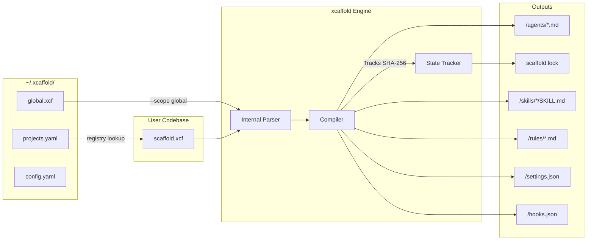
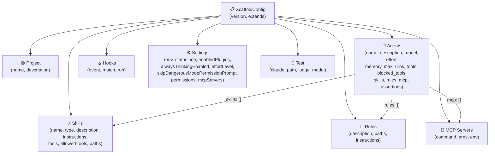

# Architecture Overview

`xcaffold` operates on a strictly deterministic, One-Way Compiler architecture for managing agent configuration setups.

## System Diagram



## AST Object Model

All `.xcf` configurations parse into this AST. The canonical types live in `internal/ast/types.go`.



## Compilation Output Structure

```
<target_dir>/
├── agents/
│   ├── developer.md         ← frontmatter (name, description, model, etc.) + body (instructions)
│   └── cto.md
├── skills/
│   └── git-workflow/
│       └── SKILL.md          ← frontmatter + body
├── rules/
│   └── code-review.md        ← frontmatter + body
├── hooks.json                 ← JSON map of hook configs
└── settings.json              ← merged MCP + Settings block
```

### settings.json Compilation

The compiler merges two sources into `settings.json`:
1. **`mcp:` top-level block** — convenience shorthand for MCP server declarations
2. **`settings:` block** — full settings structure (env, statusLine, enabledPlugins, etc.)

Merge rule: `settings.mcpServers` takes precedence over `mcp:` entries with the same key.

## Key Architectural Decisions

These inline architecture decisions record the reasoning behind strict implementation choices that shape the `xcaffold` engine.

### 1. One-Way Compilation
**Decision:** We compile `.xcf` directly to native platform configurations (e.g. `.claude/`, `.cursor/`, `.agents/`) and explicitly forbid bidirectional synchronization.
**Why:** Allowing users to manually tweak target-specific configuration files and attempting to backport those changes into `.xcf` introduces catastrophic parsing drift and state synchronization conflicts. Developers MUST update their `scaffold.xcf` file directly. Any manual changes in the generation target directories will be correctly flagged and overwritten during deployment.

### 2. WASM Tokenizer (`wazero`)
**Decision:** We embed Anthropic's `@anthropic-ai/tokenizer` via a JavaScript-compiled binary running within the `wazero` WebAssembly runtime inside Go.
**Why:** Using a native custom Go implementation created subtle BPE token boundary drift compared to the official API, leading to unpredictable plan budgeting. `wazero` guarantees absolute bit-for-bit counting parity without requiring a bloated CGO stack or Python embeddings, ensuring cross-platform stability.

### 3. Proxy Boundary Defenses
**Decision:** `xcaffold test` sandboxes agents by spawning a transport-layer HTTP proxy interceptor.
**Why:** Simulating tool execution without an intercept limits visibility. The HTTP proxy strictly confines the agent network, asserts safe boundary defenses preventing actual local side-effects, and accurately aggregates execution into `trace.jsonl` data.

### 4. Path Traversal Defense-in-Depth
**Decision:** All resource IDs (agents, skills, rules, hooks, MCP) are validated at parse time for path traversal characters (`/`, `\`, `..`).
**Why:** The compiler uses `filepath.Clean` on output paths, but defense-in-depth requires rejecting malicious IDs before they reach the compiler. Hook IDs are especially sensitive because they carry an arbitrary `run:` shell command.

### 5. Skills as Directories
**Decision:** Skills compile to `skills/<id>/SKILL.md` (directory structure), not `skills/<id>.md` (flat files).
**Why:** Target platforms (like Claude Code) expect skills in directories. Real skills have `references/` subdirectories with supplementary documents. The directory structure allows future `references:` support.

### 6. Centralized Global Home (`~/.xcaffold/`)
**Decision:** All xcaffold global state lives in `~/.xcaffold/`, not coupled to any single platform directory.
**Why:** The previous `~/.claude/` location coupled xcaffold to one platform target. A neutral home directory allows cross-platform registry, user preferences, and future profile support without target bias.
