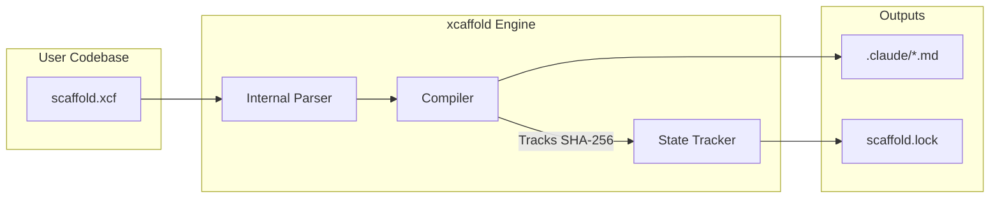

# Architecture Overview

`xcaffold` operates on a strictly deterministic, One-Way Compiler architecture for managing agent configuration setups.

## System Diagram

## Key Architectural Decisions

These inline architecture decisions record the reasoning behind strict implementation choices that shape the `xcaffold` engine.

### 1. One-Way Compilation
**Decision:** We compile `.xcf` directly to `.claude/` and explicitly forbid bidirectional synchronization.
**Why:** Allowing users to manually tweak `.claude/agents/*.md` and attempting to backport those changes into `.xcf` introduces catastrophic parsing drift and state synchronization conflicts. Developers MUST update their `scaffold.xcf` file directly. Any manual `.claude/` changes will be correctly flagged and overwritten during deployment.

### 2. WASM Tokenizer (`wazero`)
**Decision:** We embed Anthropic's `@anthropic-ai/tokenizer` via a JavaScript-compiled binary running within the `wazero` WebAssembly runtime inside Go.
**Why:** Using a native custom Go implementation created subtle BPE token boundary drift compared to the official API, leading to unpredictable plan budgeting. `wazero` guarantees absolute bit-for-bit counting parity without requiring a bloated CGO stack or Python embeddings, ensuring cross-platform stability.

### 3. Proxy Boundary Defenses
**Decision:** `xcaffold test` sandboxes agents by spawning a transport-layer HTTP proxy interceptor.
**Why:** Simulating tool execution without an intercept limits visibility. The HTTP proxy strictly confines the agent network, asserts safe boundary defenses preventing actual local side-effects, and accurately aggregates execution into `trace.jsonl` data.
