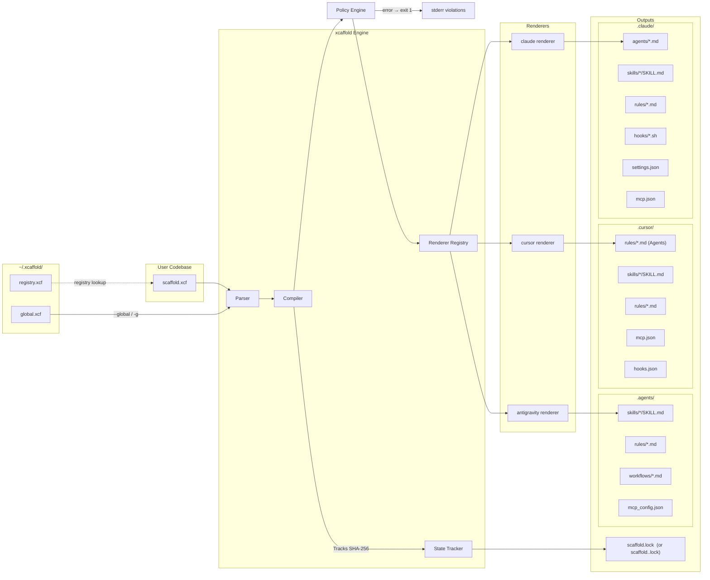

# Architecture Overview

`xcaffold` operates on a strictly deterministic, One-Way Compiler architecture for managing agent configuration setups. It targets multiple platforms (Claude Code, Cursor, and Antigravity) from a single `.xcf` YAML source.

---

## System Diagram



---

## Two Compilation Scopes

| Flag | Source | Output root |
|---|---|---|
| _(default)_ | `./scaffold.xcf` | `./.claude/` (or `.cursor/`, `.agents/`) |
| `--global / -g` | `~/.xcaffold/global.xcf` | `~/.claude/` (or `~/.cursor/`, `~/.agents/`) |

The two scopes are fully independent compilations with no atomicity guarantee. To compile both, run `xcaffold apply --global` then `xcaffold apply` separately.

The output root is determined by the `--target` flag on `xcaffold apply`:

| Target flag | Output directory |
|---|---|
| `claude` (default) | `.claude/` |
| `cursor` | `.cursor/` |
| `antigravity` | `.agents/` |

Lock files follow a naming convention:
- `claude` → `scaffold.lock` (default, backward compatible)
- `cursor` → `scaffold.cursor.lock`
- `antigravity` → `scaffold.antigravity.lock`

---

## Global Home (`~/.xcaffold/`)

Created automatically on first run by `registry.EnsureGlobalHome()`. Contains two seed files:

| File | Purpose |
|---|---|
| `global.xcf` | User-wide agent config (includes `kind: config` discriminator) — auto-bootstrapped by scanning installed platform providers |
| `registry.xcf` | YAML list of all registered projects (`name`, `path`, `targets`, `registered`, `last_applied`) |

`global.xcf` is rebuilt by `RebuildGlobalXCF()`, which iterates a `globalProviders` registry. Currently two providers are active:

| Provider | Scanned paths |
|---|---|
| **Claude Code** | `~/.claude/agents/`, `~/.claude/skills/`, `~/.claude/rules/`, `~/.claude/CLAUDE.md`, `~/.claude.json` (mcpServers) |
| **Antigravity** | `~/.gemini/antigravity/skills/`, `~/.gemini/GEMINI.md`, `~/.gemini/antigravity/mcp_config.json` |

> New providersare added by implementing a scan function and appending it to `globalProviders` in `internal/registry/registry.go`. No other changes are required.

---

### File Taxonomy (`kind:` Discriminator)

Every `.xcf` file in `~/.xcaffold/` carries a `kind:` field as its first key. The parser scanner reads this field before attempting full parsing to determine if the file should be processed:

| Kind value | Schema | Parser |
|---|---|---|
| `config` (or absent) | `XcaffoldConfig` | `parser.ParseDirectory()` |
| `policy` | `PolicyConfig` | `policy.ParseFile()` |
| `registry` | `{kind, projects}` | `registry.readProjects()` |

Files without a `kind:` field are treated as `config` for backward compatibility. Files with any other `kind:` value are silently skipped by the directory scanner — this prevents non-config files (like `registry.xcf`) from crashing the strict `KnownFields(true)` parser.

---

## Internal Package Map

| Package | Path | Role |
|---|---|---|
| `ast` | `internal/ast/` | Core types: `ResourceScope` (shared resource block), `XcaffoldConfig`, `*ProjectConfig`, and all resource configs |
| `parser` | `internal/parser/` | Strict YAML parsing — unknown fields fail immediately |
| `policy` | `internal/policy/` | Zero-dependency constraint engine — evaluates built-in and user-defined `kind: policy` files against the AST and compiled output |
| `compiler` | `internal/compiler/` | Routes AST to the correct renderer; exposes `Compile()` and `OutputDir()` |
| `renderer` | `internal/renderer/` | `TargetRenderer` interface + `Registry` |
| `renderer/claude` | `internal/renderer/claude/` | Claude Code renderer (`→ .claude/`) |
| `renderer/cursor` | `internal/renderer/cursor/` | Cursor renderer (`→ .cursor/`) |
| `renderer/antigravity` | `internal/renderer/antigravity/` | Antigravity renderer (`→ .agents/`) |
| `output` | `internal/output/` | `Output` struct — `map[relPath]content` file map |
| `state` | `internal/state/` | SHA-256 `scaffold.lock` generation, read, and write |
| `registry` | `internal/registry/` | Global home bootstrap, project registry CRUD, platform provider scans |
| `analyzer` | `internal/analyzer/` | Detects undeclared artifacts via `ScanOutputDir` |
| `bir` | `internal/bir/` | Build Intermediate Representation — `SemanticUnit`, `FunctionalIntent`, `ProjectIR` |
| `translator` | `internal/translator/` | Decomposes `SemanticUnit` intents into target primitives (skill/rule/permission) |
| `resolver` | `internal/resolver/` | Resolves `instructions_file:` and `references:` relative paths |
| `generator` | `internal/generator/` | Anthropic API calls for scaffold generation; outputs `audit.json` |
| `judge` | `internal/judge/` | LLM-as-a-Judge evaluation against agent assertions |
| `proxy` | `internal/proxy/` | HTTP intercept proxy for sandboxed agent simulation; records `trace.jsonl` |
| `trace` | `internal/trace/` | Concurrent-safe JSONL execution trace recording |
| `auth` | `internal/auth/` | Authentication helpers for CLI-to-API flows |
| `llmclient` | `internal/llmclient/` | Provider-agnostic LLM HTTP client (Anthropic API + `claude` CLI) |
| `prompt` | `internal/prompt/` | Interactive terminal prompt helpers (e.g. `Confirm()`) |
| `mascot` | `internal/mascot/` | ASCII art mascot renderer for CLI output |
| `integration` | `internal/integration/` | Integration test utilities |

---

## Compilation Output Structure

```
<target_dir>/
├── .claude/
│   ├── agents/
│   │   ├── developer.md
│   │   └── cto.md
│   ├── skills/
│   │   └── git-workflow/
│   │       └── SKILL.md
│   ├── rules/
│   │   └── code-review.md
│   ├── settings.json
│   └── mcp.json
├── .cursor/
│   ├── rules/                 ← Agents are compiled as rule files
│   │   └── developer.mdc
│   ├── skills/
│   │   └── git-workflow/
│   │       └── SKILL.md
│   ├── hooks.json
│   └── mcp.json
└── .agents/                   ← (Antigravity target)
    ├── workflows/
    │   └── publish.md
    ├── skills/
    │   └── git-workflow/
    │       └── SKILL.md
    ├── rules/
    │   └── code-review.md
    └── mcp_config.json
```

### `settings.json` Compilation

The compiler merges two sources into `settings.json`:

1. **`mcp:` top-level block** — convenience shorthand for MCP server declarations
2. **`settings:` block** — full settings structure (env, statusLine, enabledPlugins, sandbox, permissions, etc.)

**Merge rule:** `settings.mcpServers` takes precedence over `mcp:` entries with the same key.

The `local:` block within `project:` is a `SettingsConfig` variant that allows machine-local overrides (e.g. paths, secrets) without polluting the committed `scaffold.xcf`. It compiles to `settings.local.json`.

---

## CLI Lifecycle: The 8-Phase Orchestration Engine

```
Bootstrap   → xcaffold init
Ingestion   → xcaffold import    (native or --source cross-platform translation)
Audit       → xcaffold analyze   (LLM-based repo audit)
Topology    → xcaffold graph     (ASCII / mermaid / DOT / JSON output)
Compilation → xcaffold apply     (XCF → policy evaluation → target output files + scaffold.lock)
Drift Check → xcaffold diff      (compares scaffold.lock against live output files)
Validation  → xcaffold test      (LLM-in-the-loop proxy sandbox)
Export      → xcaffold export    (packages compiled output as a distributable plugin)
```

> For complete details on the command-line interface, including flags and utilities, please see the [CLI Reference](../reference/cli.md).

---

## Cross-Platform Translation Pipeline (BIR)

When `xcaffold import --source` is used, the engine runs a semantic translation pipeline:

```
Source .md files
  → bir.ImportWorkflow()         builds SemanticUnit (ID, kind, resolvedBody)
  → bir.DetectIntents()          static regex analysis (no LLM)
      IntentProcedure  → numbered steps or ## Steps section
      IntentConstraint → lines containing MUST/NEVER/ALWAYS/DO NOT/MANDATORY/REQUIRED
      IntentAutomation → lines containing // turbo annotation
  → translator.Translate()       maps intents to target primitives
      IntentProcedure  → TargetPrimitive{Kind: "skill",      ID: <id>}
      IntentConstraint → TargetPrimitive{Kind: "rule",       ID: <id>-constraints}
      IntentAutomation → TargetPrimitive{Kind: "permission", ID: <id>-permissions}
  → injectIntoConfig()           writes external .md files + updates scaffold.xcf
```

If a `SemanticUnit` has no detected intents, it falls back to a single `skill` primitive containing the full body.

---

> For a detailed explanation of the renderer interface and multi-target output architecture, see [Multi-Target Rendering](multi-target-rendering.md).

> For a detailed explanation of lock manifests, drift detection, and per-target state tracking, see [Drift Detection and State](drift-detection-state.md).

---

## Key Architectural Decisions

These inline architecture decisions record the reasoning behind strict implementation choices that shape the `xcaffold` engine. Formal ADRs live in `.agents/skills/adr-management/`.

> For a detailed explanation of one-way compilation and the declarative source-of-truth model, see [Declarative Compilation](declarative-compilation.md).

> For a detailed explanation of the proxy sandbox and runtime boundary defenses, see [Sandboxing](sandboxing.md).

### 1. Path Traversal Defense-in-Depth
**Decision:** All resource IDs (agents, skills, rules, hooks, MCP) are validated at parse time for path traversal characters (`/`, `\`, `..`).
**Why:** The compiler uses `filepath.Clean` on output paths, but defense-in-depth requires rejecting malicious IDs before they reach the compiler. Hook IDs are especially sensitive because they carry an arbitrary `run:` shell command.

### 2. Skills as Directories
**Decision:** Skills compile to `skills/<id>/SKILL.md` (directory structure), not `skills/<id>.md` (flat files).
**Why:** Target platforms (like Claude Code) expect skills in directories. Real skills have `references/` subdirectories with supplementary documents. The directory structure allows future `references:` support.

### 3. Centralized Global Home (`~/.xcaffold/`)
**Decision:** All xcaffold global state lives in `~/.xcaffold/`, not coupled to any single platform directory.
**Why:** The previous `~/.claude/` location coupled xcaffold to one platform target. A neutral home directory allows cross-platform registry, user preferences, and future profile support without target bias.

> For a detailed explanation of the multi-target renderer architecture and the Registry dispatch pattern, see [Multi-Target Rendering](multi-target-rendering.md).

### 4. BIR Semantic Translation Layer
**Decision:** Cross-platform workflow import uses a two-phase pipeline: first build a `SemanticUnit` (BIR), then run static regex-based intent detection, then map to xcaffold primitives via `translator.Translate()`.
**Why:** Direct format conversion (e.g. Antigravity workflow → Claude rule) loses semantic structure. The BIR/intent layer preserves the original body while extracting meaning — constraints become rules, procedures become skills, automation annotations become permissions — enabling correct round-tripping across platforms.

### 5. `registry.xcf` File Naming
**Decision:** The project registry file is `registry.xcf` (not `projects.yaml`). User preferences (e.g. `default_target`) are stored in the `settings:` block of `global.xcf` rather than a separate file.
**Why:** Using `.xcf` extension for all xcaffold-managed configuration files provides a consistent, recognizable file type. Consolidating preferences into `global.xcf` eliminates a separate file that had no type discriminator and adds to the configuration surface area.

### 6. `TestConfig.CliPath` (generalized from `ClaudePath`)
**Decision:** The `test:` block uses `cli_path` as the primary field (with `claude_path` retained for backward compatibility).
**Why:** As xcaffold becomes platform-agnostic, the CLI under test is not always `claude`. The generalized `cli_path` supports any binary (e.g. `cursor`, a custom wrapper), while the deprecated alias ensures existing configs continue to work without changes.

### 7. ResourceScope Extraction and Pointer-Backed ProjectConfig
**Decision:** Generative primitives (agents, skills, rules, hooks, MCP, workflows) are extracted into a `ResourceScope` struct embedded with `yaml:",inline"` in both `XcaffoldConfig` (global scope) and `ProjectConfig` (workspace scope). `Project` is a pointer (`*ProjectConfig`) — nil means global scope.
**Why:** The flat AST where all resources lived at root level alongside `project:`, `settings:`, and `test:` made no semantic distinction between global-scope resources (user-wide) and project-scope resources (workspace-specific). Embedding `ResourceScope` at both levels enables the compiler to merge workspace resources over global resources by ID, giving project configs explicit override authority. The pointer distinguishes "no project block" (global config) from "empty project block" (project config with defaults) at the type level, eliminating the need for parser flags to detect scope.

### 8. Policy Enforcement Engine
**Decision:** The engine runs deterministically during `xcaffold apply` and `xcaffold validate` against a deep-copied AST before compiler mutation, hard-blocking generation on `error` violations. Configuration overrides are handled by defining a `kind: policy` file with the same `name` and `severity: off`.
**Why:** Linters running *after* generation offer weak security guarantees. Fail-closed policy evaluation prior to compilation guarantees output files always respect path constraints and invariants. The name-based override mechanism avoids polluting the central schema with bypass flags, adhering to the project's declarative, GitOps-driven architecture.
