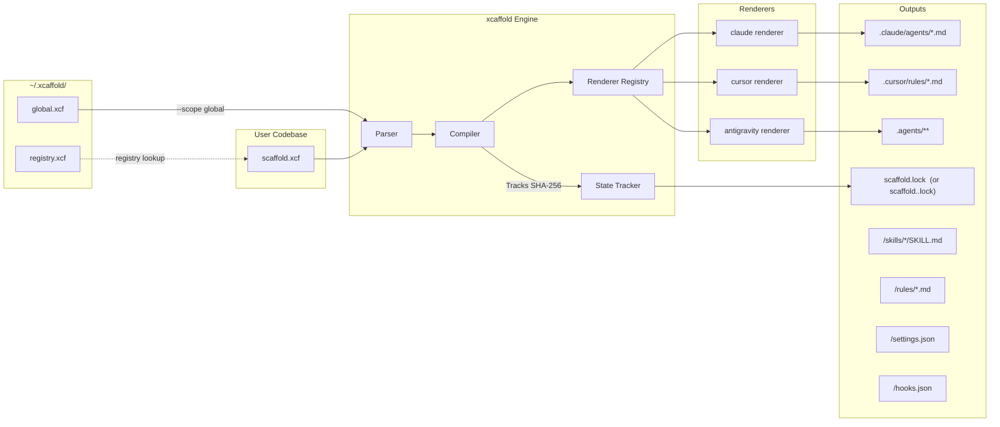

# Architecture Overview

`xcaffold` operates on a strictly deterministic, One-Way Compiler architecture for managing agent configuration setups. It targets multiple platforms (Claude Code, Cursor, and Antigravity) from a single `.xcf` YAML source.

---

## System Diagram



---

## Three Compilation Scopes

| Scope flag | Source | Output root |
|---|---|---|
| `project` (default) | `./scaffold.xcf` | `./.claude/` (or `.cursor/`, `.agents/`) |
| `--scope global` | `~/.xcaffold/global.xcf` | `~/.claude/` (or `~/.cursor/`, `~/.agents/`) |
| `--scope all` | Both of the above | Both output roots |

The output root is determined by the `--target` flag on `xcaffold apply`:

| Target flag | Output directory |
|---|---|
| `claude` (default) | `.claude/` |
| `cursor` | `.cursor/` |
| `antigravity` | `.agents/` |

Lock files follow a naming convention:
- `claude` → `scaffold.lock` (default, backward compatible)
- `cursor` → `scaffold.cursor.lock`
- `antigravity` → `scaffold.antigravity.lock`

---

## Global Home (`~/.xcaffold/`)

Created automatically on first run by `registry.EnsureGlobalHome()`. Contains two seed files:

| File | Purpose |
|---|---|
| `global.xcf` | User-wide agent config (includes `kind: config` discriminator) — auto-bootstrapped by scanning installed platform providers |
| `registry.xcf` | YAML list of all registered projects (`name`, `path`, `targets`, `registered`, `last_applied`) |

`global.xcf` is rebuilt by `RebuildGlobalXCF()`, which iterates a `globalProviders` registry. Currently two providers are active:

| Provider | Scanned paths |
|---|---|
| **Claude Code** | `~/.claude/agents/`, `~/.claude/skills/`, `~/.claude/rules/`, `~/.claude/CLAUDE.md`, `~/.claude.json` (mcpServers) |
| **Antigravity** | `~/.gemini/antigravity/skills/`, `~/.gemini/GEMINI.md`, `~/.gemini/antigravity/mcp_config.json` |

> New providersare added by implementing a scan function and appending it to `globalProviders` in `internal/registry/registry.go`. No other changes are required.

---

### File Taxonomy (`kind:` Discriminator)

Every `.xcf` file in `~/.xcaffold/` carries a `kind:` field as its first key. The parser scanner reads this field before attempting full parsing to determine if the file should be processed:

| Kind value | Schema | Parser |
|---|---|---|
| `config` (or absent) | `XcaffoldConfig` | `parser.ParseDirectory()` |
| `registry` | `{kind, projects}` | `registry.readProjects()` |

Files without a `kind:` field are treated as `config` for backward compatibility. Files with any other `kind:` value are silently skipped by the directory scanner — this prevents non-config files (like `registry.xcf`) from crashing the strict `KnownFields(true)` parser.

---

## Internal Package Map

| Package | Path | Role |
|---|---|---|
| `ast` | `internal/ast/` | Core types for all `.xcf` parsed structures |
| `parser` | `internal/parser/` | Strict YAML parsing — unknown fields fail immediately |
| `compiler` | `internal/compiler/` | Routes AST to the correct renderer; exposes `Compile()` and `OutputDir()` |
| `renderer` | `internal/renderer/` | `TargetRenderer` interface + `Registry` |
| `renderer/claude` | `internal/renderer/claude/` | Claude Code renderer (`→ .claude/`) |
| `renderer/cursor` | `internal/renderer/cursor/` | Cursor renderer (`→ .cursor/`) |
| `renderer/antigravity` | `internal/renderer/antigravity/` | Antigravity renderer (`→ .agents/`) |
| `output` | `internal/output/` | `Output` struct — `map[relPath]content` file map |
| `state` | `internal/state/` | SHA-256 `scaffold.lock` generation, read, and write |
| `registry` | `internal/registry/` | Global home bootstrap, project registry CRUD, platform provider scans |
| `analyzer` | `internal/analyzer/` | Detects undeclared artifacts via `ScanOutputDir` |
| `bir` | `internal/bir/` | Build Intermediate Representation — `SemanticUnit`, `FunctionalIntent`, `ProjectIR` |
| `translator` | `internal/translator/` | Decomposes `SemanticUnit` intents into target primitives (skill/rule/permission) |
| `resolver` | `internal/resolver/` | Resolves `instructions_file:` and `references:` relative paths |
| `generator` | `internal/generator/` | Anthropic API calls for scaffold generation; outputs `audit.json` |
| `judge` | `internal/judge/` | LLM-as-a-Judge evaluation against agent assertions |
| `proxy` | `internal/proxy/` | HTTP intercept proxy for sandboxed agent simulation; records `trace.jsonl` |
| `trace` | `internal/trace/` | Concurrent-safe JSONL execution trace recording |
| `auth` | `internal/auth/` | Authentication helpers for CLI-to-API flows |
| `llmclient` | `internal/llmclient/` | Provider-agnostic LLM HTTP client (Anthropic API + `claude` CLI) |
| `prompt` | `internal/prompt/` | Interactive terminal prompt helpers (e.g. `Confirm()`) |
| `mascot` | `internal/mascot/` | ASCII art mascot renderer for CLI output |
| `integration` | `internal/integration/` | Integration test utilities |

---

## Compilation Output Structure

```
<target_dir>/
├── agents/
│   ├── developer.md         ← YAML frontmatter (name, description, model, etc.) + markdown body
│   └── cto.md
├── skills/
│   └── git-workflow/
│       └── SKILL.md          ← YAML frontmatter + markdown body
├── rules/
│   └── code-review.md        ← YAML frontmatter + markdown body
├── hooks.json                 ← JSON map of hook configs (only written when hooks are declared)
└── settings.json              ← merged MCP + Settings block
```

### `settings.json` Compilation

The compiler merges two sources into `settings.json`:

1. **`mcp:` top-level block** — convenience shorthand for MCP server declarations
2. **`settings:` block** — full settings structure (env, statusLine, enabledPlugins, sandbox, permissions, etc.)

**Merge rule:** `settings.mcpServers` takes precedence over `mcp:` entries with the same key.

The `local:` top-level block is a `SettingsConfig` variant that allows machine-local overrides (e.g. paths, secrets) without polluting the committed `scaffold.xcf`.

---

## CLI Lifecycle: The 8-Phase Orchestration Engine

```
Bootstrap   → xcaffold init
Ingestion   → xcaffold import    (native or --source cross-platform translation)
Audit       → xcaffold analyze   (LLM-based repo audit)
Topology    → xcaffold graph     (ASCII / mermaid / DOT / JSON output)
Compilation → xcaffold apply     (XCF → target output files + scaffold.lock)
Drift Check → xcaffold diff      (compares scaffold.lock against live output files)
Validation  → xcaffold test      (LLM-in-the-loop proxy sandbox)
Export      → xcaffold export    (packages compiled output as a distributable plugin)
```

### Utilities

| Command | Description |
|---|---|
| `xcaffold review [file]` | Universal parser for `scaffold.xcf`, `audit.json`, `plan.json`, `trace.jsonl` |
| `xcaffold list` | Lists all registered projects (reads `~/.xcaffold/registry.xcf`) |
| `xcaffold migrate` | Upgrades legacy layouts (`~/.claude/global.xcf` → `~/.xcaffold/global.xcf`, flat paths → reference-in-place) |

### Global Flags

| Flag | Default | Purpose |
|---|---|---|
| `--config <path>` | `./scaffold.xcf` | Override `.xcf` file path (for monorepo sub-directories) |
| `--scope <scope>` | `project` | Compilation scope: `project`, `global`, or `all` |

### `xcaffold apply` Flags

| Flag | Purpose |
|---|---|
| `--target <target>` | Output platform: `claude` (default), `cursor`, `antigravity` |
| `--dry-run` | Preview unified diff without writing to disk |
| `--check` | Validate YAML syntax without compiling |

### `xcaffold graph` Flags

| Flag | Purpose |
|---|---|
| `--format <fmt>` | `terminal` (default), `mermaid`, `dot`, `json` |
| `--agent <id>` | Filter topology to a single agent |
| `--project <name>` | Target a specific registered project by name or path |
| `--full / -f` | Show fully expanded topology tree |
| `--scan-output` | Scan compiled output directories for undeclared artifacts |

### `xcaffold import` Flags

| Flag | Purpose |
|---|---|
| `--source <path>` | Activate cross-platform translation mode (file or directory of `.md` workflow files) |
| `--from <platform>` | Source platform: `antigravity`, `cursor`, etc. (default: `auto`) |
| `--plan` | Dry-run: print decomposition plan without writing files |

---

## Cross-Platform Translation Pipeline (BIR)

When `xcaffold import --source` is used, the engine runs a semantic translation pipeline:

```
Source .md files
  → bir.ImportWorkflow()         builds SemanticUnit (ID, kind, resolvedBody)
  → bir.DetectIntents()          static regex analysis (no LLM)
      IntentProcedure  → numbered steps or ## Steps section
      IntentConstraint → lines containing MUST/NEVER/ALWAYS/DO NOT/MANDATORY/REQUIRED
      IntentAutomation → lines containing // turbo annotation
  → translator.Translate()       maps intents to target primitives
      IntentProcedure  → TargetPrimitive{Kind: "skill",      ID: <id>}
      IntentConstraint → TargetPrimitive{Kind: "rule",       ID: <id>-constraints}
      IntentAutomation → TargetPrimitive{Kind: "permission", ID: <id>-permissions}
  → injectIntoConfig()           writes external .md files + updates scaffold.xcf
```

If a `SemanticUnit` has no detected intents, it falls back to a single `skill` primitive containing the full body.

---

## Renderer Interface

Each output target (Claude, Cursor, Antigravity) implements `TargetRenderer`:

```go
type TargetRenderer interface {
    Target()    string          // canonical name: "claude", "cursor", "antigravity"
    OutputDir() string          // base output directory: ".claude", ".cursor", ".agents"
    Render(files map[string]string) *output.Output
}
```

Renderers are composed via a `Registry` and dispatched by `compiler.Compile(config, baseDir, target)`. Each renderer is responsible for transforming the AST into the file layout expected by its platform. Adding a new platform requires only a new `TargetRenderer` implementation — no changes to the compiler core.

---

## State Tracking (`scaffold.lock`)

After each successful `xcaffold apply`, a lock manifest is written to `scaffold.lock` (or `scaffold.<target>.lock` for non-claude targets):

```yaml
version: 1
last_applied: "2026-04-08T07:00:00Z"
xcaffold_version: "1.0.0"
claude_schema_version: "alpha"
artifacts:
  - path: agents/developer.md
    hash: sha256:abc123...
  - path: settings.json
    hash: sha256:def456...
```

Artifacts are sorted by path to guarantee deterministic output. `xcaffold diff` uses this manifest to detect manual drift (files modified outside of `xcaffold apply`).

---

## Key Architectural Decisions

These inline architecture decisions record the reasoning behind strict implementation choices that shape the `xcaffold` engine. Formal ADRs live in `.agents/skills/adr-management/`.

### 1. One-Way Compilation
**Decision:** We compile `.xcf` directly to native platform configurations (e.g. `.claude/`, `.cursor/`, `.agents/`) and explicitly forbid bidirectional synchronization.
**Why:** Allowing users to manually tweak target-specific configuration files and attempting to backport those changes into `.xcf` introduces catastrophic parsing drift and state synchronization conflicts. Developers MUST update their `scaffold.xcf` file directly. Any manual changes in the generation target directories will be correctly flagged and overwritten during deployment.

### 2. Proxy Boundary Defenses
**Decision:** `xcaffold test` sandboxes agents by spawning a transport-layer HTTP proxy interceptor.
**Why:** Simulating tool execution without an intercept limits visibility. The HTTP proxy strictly confines the agent network, asserts safe boundary defenses preventing actual local side-effects, and accurately aggregates execution into `trace.jsonl` data.

### 3. Path Traversal Defense-in-Depth
**Decision:** All resource IDs (agents, skills, rules, hooks, MCP) are validated at parse time for path traversal characters (`/`, `\`, `..`).
**Why:** The compiler uses `filepath.Clean` on output paths, but defense-in-depth requires rejecting malicious IDs before they reach the compiler. Hook IDs are especially sensitive because they carry an arbitrary `run:` shell command.

### 4. Skills as Directories
**Decision:** Skills compile to `skills/<id>/SKILL.md` (directory structure), not `skills/<id>.md` (flat files).
**Why:** Target platforms (like Claude Code) expect skills in directories. Real skills have `references/` subdirectories with supplementary documents. The directory structure allows future `references:` support.

### 5. Centralized Global Home (`~/.xcaffold/`)
**Decision:** All xcaffold global state lives in `~/.xcaffold/`, not coupled to any single platform directory.
**Why:** The previous `~/.claude/` location coupled xcaffold to one platform target. A neutral home directory allows cross-platform registry, user preferences, and future profile support without target bias.

### 6. Multi-Target Renderer Architecture
**Decision:** The compiler dispatches to a `TargetRenderer` via a `Registry` keyed by target name. Each platform is a separate Go package under `internal/renderer/<target>/`.
**Why:** A monolithic compiler with `if target == "claude" { ... } else if target == "cursor" { ... }` branches does not scale and cannot be extended by third parties. The Registry pattern allows adding new targets (e.g.) without touching the compiler core. Each renderer owns its own output contract.

### 7. BIR Semantic Translation Layer
**Decision:** Cross-platform workflow import uses a two-phase pipeline: first build a `SemanticUnit` (BIR), then run static regex-based intent detection, then map to xcaffold primitives via `translator.Translate()`.
**Why:** Direct format conversion (e.g. Antigravity workflow → Claude rule) loses semantic structure. The BIR/intent layer preserves the original body while extracting meaning — constraints become rules, procedures become skills, automation annotations become permissions — enabling correct round-tripping across platforms.

### 8. `registry.xcf` File Naming
**Decision:** The project registry file is `registry.xcf` (not `projects.yaml`). User preferences (e.g. `default_target`) are stored in the `settings:` block of `global.xcf` rather than a separate file.
**Why:** Using `.xcf` extension for all xcaffold-managed configuration files provides a consistent, recognizable file type. Consolidating preferences into `global.xcf` eliminates a separate file that had no type discriminator and adds to the configuration surface area.

### 9. `TestConfig.CliPath` (generalized from `ClaudePath`)
**Decision:** The `test:` block uses `cli_path` as the primary field (with `claude_path` retained for backward compatibility).
**Why:** As xcaffold becomes platform-agnostic, the CLI under test is not always `claude`. The generalized `cli_path` supports any binary (e.g. `cursor`, a custom wrapper), while the deprecated alias ensures existing configs continue to work without changes.
