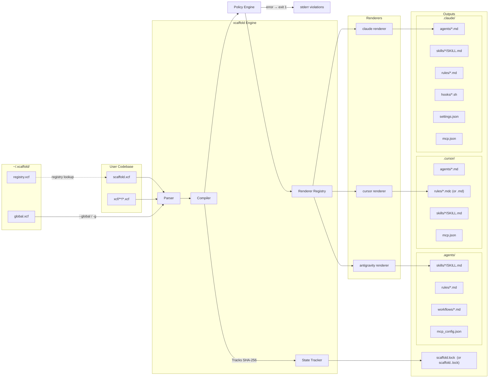

# Architecture Overview

`xcaffold` operates on a strictly deterministic, One-Way Compiler architecture for managing agent configurations across multiple platforms. It targets [multiple supported platforms](supported-providers.md) from a single `.xcf` file.

---

## System Diagram



---

## Two Compilation Scopes

| Flag | Source | Output root |
|---|---|---|
| _(default)_ | `./scaffold.xcf` | `./.claude/` (or `.cursor/`, `.agents/`) |
| `--global / -g` | `~/.xcaffold/global.xcf` | `~/.claude/` (or `~/.cursor/`, `~/.agents/`) |

The two scopes are fully independent compilations with no atomicity guarantee. To compile both, run `xcaffold apply --global` then `xcaffold apply` separately.

The output root is determined by the `--target` flag on `xcaffold apply`:

| Target flag | Output directory |
|---|---|
| `claude` (default) | `.claude/` |
| `cursor` | `.cursor/` |
| `antigravity` | `.agents/` |

Lock files follow a naming convention:
- `claude` → `scaffold.lock` (default, backward compatible)
- `cursor` → `scaffold.cursor.lock`
- `antigravity` → `scaffold.antigravity.lock`

---

## Global Home (`~/.xcaffold/`)

Created automatically on first run by `registry.EnsureGlobalHome()`. Contains two seed files:

| File | Purpose |
|---|---|
| `global.xcf` | User-wide agent config (uses `kind: global` for global-scope resources and settings) — auto-bootstrapped by scanning installed platform providers |
| `registry.xcf` | YAML list of all registered projects (`name`, `path`, `targets`, `registered`, `last_applied`) |

`global.xcf` is rebuilt by `RebuildGlobalXCF()`, which iterates a `globalProviders` registry containing the [supported platforms](../reference/supported-providers.md). During a scan, these providers read their specific configuration artifacts (e.g., skill directories, standalone global instructions) to bootstrap a multi-provider `.xcf`.

> New providers are added by implementing a scan function and appending it to `globalProviders` in `internal/registry/registry.go`. No other changes are required.

---

### File Taxonomy (`kind:` Discriminator)

Every `.xcf` file carries a `kind:` field as its first key. The parser reads this field before attempting full parsing to determine how the file should be processed:

| Kind value | Schema | Parser | Notes |
|---|---|---|---|
| `project` | `XcaffoldConfig` | `parser.ParseDirectory()` | Primary format. Exactly 1 required per project. Declares name, targets, resource refs. |
| `hooks` | `XcaffoldConfig` | `parser.ParseDirectory()` | Standalone hooks with `events:` wrapper |
| `settings` | `XcaffoldConfig` | `parser.ParseDirectory()` | Standalone settings |
| `global` | `XcaffoldConfig` | `parser.ParseDirectory()` | Global-scope resources and settings |
| `policy` | `PolicyConfig` | `parseResourceDocument()` | Declarative constraint (standardized kind) |
| `registry` | `{kind, projects}` | `registry.readProjects()` | |

Every `.xcf` file must declare an explicit `kind:` field. Files with unrecognized `kind:` values (like `registry`) are silently skipped by the directory scanner — this prevents non-config files from crashing the strict `KnownFields(true)` parser.

---

## Internal Package Map

| Package | Path | Role |
|---|---|---|
| `ast` | `internal/ast/` | Core types: `ResourceScope` (shared resource block), `XcaffoldConfig`, `*ProjectConfig`, and all resource configs |
| `parser` | `internal/parser/` | Strict YAML parsing — unknown fields fail immediately |
| `policy` | `internal/policy/` | Post-compile constraint engine -- evaluates built-in and user-defined policies against AST snapshot and compiled output |
| `compiler` | `internal/compiler/` | Routes AST to the correct renderer; exposes `Compile()` and `OutputDir()` |
| `renderer` | `internal/renderer/` | `TargetRenderer` interface + `Registry` |
| `renderer/claude` | `internal/renderer/claude/` | Claude Code renderer (`→ .claude/`) |
| `renderer/cursor` | `internal/renderer/cursor/` | Cursor renderer (`→ .cursor/`) |
| `renderer/antigravity` | `internal/renderer/antigravity/` | Antigravity renderer (`→ .agents/`) |
| `output` | `internal/output/` | `Output` struct — `map[relPath]content` file map |
| `state` | `internal/state/` | SHA-256 `scaffold.lock` generation, read, and write |
| `registry` | `internal/registry/` | Global home bootstrap, project registry CRUD, platform provider scans |
| `templates` | `internal/templates/` | Rendering templates for references and boilerplate generation |
| `analyzer` | `internal/analyzer/` | Detects undeclared artifacts via `ScanOutputDir` |
| `bir` | `internal/bir/` | Build Intermediate Representation — `SemanticUnit`, `FunctionalIntent`, `ProjectIR`; also `bir.ReassembleWorkflow()` for round-trip reconstruction from provenance markers |
| `translator` | `internal/translator/` | Decomposes `SemanticUnit` intents into target primitives (skill/rule/permission); `TranslateWorkflow()` lowers `WorkflowConfig` to provider primitives via four strategies |
| `optimizer` | `internal/optimizer/` | Post-compile transformation pipeline for `xcaffold translate` — 7 named passes (`flatten-scopes`, `inline-imports`, `dedupe`, `extract-common`, `prune-unused`, `normalize-paths`, `split-large-rules`); required passes prepended per-target |
| `resolver` | `internal/resolver/` | Resolves `instructions-file:` and `references:` relative paths |
| `generator` | `internal/generator/` | Anthropic API calls for scaffold generation; outputs `audit.json` |
| `judge` | `internal/judge/` | LLM-as-a-Judge evaluation against agent assertions |
| `proxy` | `internal/proxy/` | HTTP intercept proxy (retained; not currently used by `xcaffold test`) |
| `trace` | `internal/trace/` | Concurrent-safe JSONL execution trace recording |
| `auth` | `internal/auth/` | Authentication helpers for CLI-to-API flows |
| `llmclient` | `internal/llmclient/` | Provider-agnostic LLM HTTP client (Anthropic API + `claude` CLI); used by `xcaffold test` for direct API simulation |
| `prompt` | `internal/prompt/` | Interactive terminal prompt helpers (e.g. `Confirm()`) |
| `integration` | `internal/integration/` | Integration test utilities |

---

## Compilation Output Structure

```
<target_dir>/
├── .claude/
│   ├── agents/
│   │   ├── developer.md
│   │   └── cto.md
│   ├── skills/
│   │   └── git-workflow/
│   │       └── SKILL.md
│   ├── rules/
│   │   └── code-review.md
│   ├── settings.json
│   └── mcp.json
├── .cursor/
│   ├── rules/                 ← Agents are compiled as rule files
│   │   └── developer.mdc
│   ├── skills/
│   │   └── git-workflow/
│   │       └── SKILL.md
│   ├── hooks.json
│   └── mcp.json
└── .agents/                   ← (Antigravity target)
    ├── workflows/
    │   └── publish.md
    ├── skills/
    │   └── git-workflow/
    │       └── SKILL.md
    ├── rules/
    │   └── code-review.md
    └── mcp_config.json
```

### `settings.json` Compilation

The compiler merges two sources into `settings.json`:

1. **`mcp:` top-level block** — convenience shorthand for MCP server declarations
2. **`settings:` block** — full settings structure (env, statusLine, enabledPlugins, sandbox, permissions, etc.)

**Merge rule:** `settings.mcpServers` takes precedence over `mcp:` entries with the same key.

The `local:` block is a `SettingsConfig` variant that allows machine-local overrides (e.g. paths, secrets) without polluting the committed `scaffold.xcf`. It compiles to `settings.local.json`. In `kind: project` format, `local:` is a top-level field (not nested under `project:`).

---

## CLI Lifecycle: The 8-Phase Orchestration Engine

```
Bootstrap    → xcaffold init
Ingestion    → xcaffold import    (native or --source cross-platform translation)
Translation  → xcaffold translate (provider-to-provider; three-phase: Import → Compile+Optimize → Apply)
Audit        → xcaffold analyze   (LLM-based repo audit)
Topology     → xcaffold graph     (ASCII / mermaid / DOT / JSON output)
Listing      → xcaffold list      (View registered projects)
Migration    → xcaffold migrate   (Upgrade legacy flat layouts)
Compilation  → xcaffold apply     (XCF → policy evaluation → target output files + scaffold.lock)
Drift Check  → xcaffold diff      (compares scaffold.lock against live output files)
Validation   → xcaffold validate  (Syntax/structural check)
Review       → xcaffold review    (Terminal-based diagnostic viewing)
Simulation   → xcaffold test      (API simulation: reads compiled agent prompt, sends task to LLM, records declared tool calls)
Export       → xcaffold export    (packages compiled output as a distributable plugin)
```

> For complete details on the command-line interface, including flags and utilities, please see the [CLI Reference](../reference/cli.md).

---

## Intermediate Representation (IR)

The **Intermediate Representation (IR)** is the provider-agnostic, in-memory form of an agent configuration — a fully parsed `ast.XcaffoldConfig` struct that contains all agents, skills, rules, workflows, hooks, memory entries, and MCP servers without any output-format concerns.

The IR is the bridge between every import, translation, and compilation phase:

| Phase | IR role |
|---|---|
| `xcaffold import` | Reads provider source files → builds IR → writes to `scaffold.xcf` (persists IR to disk) |
| `xcaffold translate` — phase 1 | Reads provider source files → builds IR (in-memory only, never written unless `--save-xcf` is set) |
| `xcaffold translate` — phase 2 | Passes IR to the compiler + optimizer → emits target output files |
| `xcaffold apply` | Reads `scaffold.xcf` from disk (the persisted IR) → compiles to target |
| `xcaffold diff` | Reads persisted IR from `scaffold.lock` hashes → detects drift |

The IR is intentionally format-neutral: the same struct that represents a Claude Code `.claude/agents/developer.md` agent also represents a Cursor `agents/developer.md` agent or an Antigravity skill. Renderers receive this struct and decide how to map it to the target format.

When you run `xcaffold translate --save-xcf ir.xcf`, the in-memory IR is serialized to disk as a `scaffold.xcf` file. This lets you inspect the IR before compilation, version-control it as a managed project, or feed it into `xcaffold apply` for ongoing GitOps management.

> **Why "IR"?** The term is borrowed from compiler design, where an IR is the normalized, source-language-independent form between parsing and code generation. xcaffold's IR plays the same role: it normalizes disjoint provider formats into a shared data model, then generates target-specific output from that model.

---

## Cross-Platform Translation Pipeline (BIR)

When `xcaffold import --source` is used, the engine runs a semantic translation pipeline that builds the IR from provider source files:

```
Source .md files
  → bir.ImportWorkflow()         builds SemanticUnit (ID, kind, resolvedBody)
  → bir.DetectIntents()          static regex analysis (no LLM)
      IntentProcedure  → numbered steps or ## Steps section
      IntentConstraint → lines containing MUST/NEVER/ALWAYS/DO NOT/MANDATORY/REQUIRED
      IntentAutomation → lines containing // turbo annotation
  → translator.Translate()       maps intents to target primitives
      IntentProcedure  → TargetPrimitive{Kind: "skill",      ID: <id>}
      IntentConstraint → TargetPrimitive{Kind: "rule",       ID: <id>-constraints}
      IntentAutomation → TargetPrimitive{Kind: "permission", ID: <id>-permissions}
  → injectIntoConfig()           (--source mode only) inlines instructions + writes split .xcf files
```

If a `SemanticUnit` has no detected intents, it falls back to a single `skill` primitive containing the full body.

`WorkflowConfig` is lowered separately via `translator.TranslateWorkflow()` using four tiered strategies:

1. **native Antigravity** — `promote-rules-to-workflows: true` in `targets.antigravity.provider` emits a single `workflows/<name>.md` primitive
2. **`prompt-file`** — Copilot lowering emits `.github/prompts/<name>.prompt.md` with xcaffold provenance frontmatter
3. **`custom-command`** — Gemini lowering emits workflow guidance to GEMINI.md context files
4. **`rule-plus-skill`** — default for Claude and Cursor; emits one rule (with `x-xcaffold:` provenance `yaml` block) + one skill per step

Provenance markers in `rule-plus-skill` output are consumed by `bir.ReassembleWorkflow()` during round-trip import to reconstruct the original `WorkflowConfig` with step fidelity.

> **Note:** `injectIntoConfig()` is used exclusively by the `--source` cross-platform translation mode. The main `xcaffold import` command uses `WriteSplitFiles` to produce `kind: project` manifests with inline instructions and individual `.xcf` resource files under `xcf/`.

---


---

## Declarative Compilation

Agent configurations are software artifacts. Like infrastructure-as-code, they should be versioned, audited, and reproduced from source — not edited in place and synced back. xcaffold enforces this by treating `.xcf` files as the authoritative source of record and compiling them, in one direction, into native runtime files for each target platform. This document explains the reasoning behind that architectural choice.

### Declarative Configuration vs Prompt-at-Runtime

The conventional approach to configuring AI agents is to paste instructions directly into an IDE panel or settings dialog. The instructions exist only in that session; they are not versioned, they cannot be diffed, and reproducing them exactly on another machine or for another team member requires manual copy-paste. This is the prompt-at-runtime model.

xcaffold uses declarative configuration compiled ahead of time. Agents, skills, rules, hooks, and MCP server bindings are declared in `.xcf` files that live alongside the codebase. Changes are made to the `.xcf` file, committed with a message, reviewed in a pull request, and rolled back with `git revert` if needed. The runtime configuration is generated, not authored.

The distinction matters beyond aesthetics. Prompt-at-runtime configurations are invisible to code review. They cannot be linted, tested, or audited. A typo in a system prompt has no stack trace. Declarative configuration surfaces these problems at compile time, before any agent executes.

### The AST as the Separation Boundary

The compiler does not transform YAML strings directly into Markdown or JSON. Between parsing and rendering sits an Abstract Syntax Tree (AST): the `XcaffoldConfig` struct, defined in `internal/ast/types.go`.

```go
type XcaffoldConfig struct {
    Kind    string `yaml:"kind,omitempty"`
    Version string `yaml:"version"`
    Extends string `yaml:"extends,omitempty"`

    Settings SettingsConfig `yaml:"settings,omitempty"`

    ResourceScope `yaml:",inline"` // Global-level resources
    Project *ProjectConfig `yaml:"project,omitempty"`
}
```

`ResourceScope` holds all the agentic primitives — agents, skills, rules, hooks, MCP servers, workflows — as typed Go maps. The AST has no knowledge of any target platform. It carries no Markdown syntax, no JSON keys specific to any runtime, no platform-specific field names.

This separation is the boundary that makes multi-target rendering possible. The same `AgentConfig` is handed to the claude renderer, which writes `.claude/agents/<id>.md`; and to the cursor renderer, which writes `.cursor/rules/<id>.mdc`. The `.xcf` source does not change. Platform-specific concerns never leak into the data model.

### Determinism as a Contract

xcaffold makes a hard guarantee: given the same `.xcf` file, every invocation of the compiler produces byte-for-byte identical output. There are no timestamps embedded in generated file content, no random identifiers, no environment-dependent paths inside compiled files.

This guarantee is what makes drift detection meaningful. After compilation, `state.GenerateWithOpts()` (`internal/state/state.go:70`) hashes every output artifact with SHA-256 and records the results in a lock file:

```go
hash := sha256.Sum256([]byte(content))
manifest.Artifacts = append(manifest.Artifacts, Artifact{
    Path: path,
    Hash: fmt.Sprintf("sha256:%x", hash),
})
```

On the next run, the lock file is compared against the current hashes of the same paths. Any divergence means someone edited a generated file directly. If determinism were not guaranteed, the compiler itself would appear to produce drift every run, making the lock file useless.

Determinism is also what makes CI verification possible. A pipeline that runs `xcaffold apply` and then checks for uncommitted changes in the target output directory only works if clean-source-in produces clean-output-out, every time.

### Multi-Document YAML Parsing

A single `.xcf` file can contain multiple YAML documents separated by `---`. The parser's `parsePartial` function loops over each document in the stream and routes it by `kind:`:

- `kind: project` populates `ProjectConfig` with the project name, targets, and resource reference lists.
- `kind: hooks`, `kind: settings`, and other resource kinds merge their contents into `ResourceScope` maps.
- `kind: global` contains global-scope resources and settings.

When `ParseDirectory` scans a project tree, it discovers all `.xcf` files recursively and merges all parsed documents into a single configuration. Strict deduplication is enforced: if the same resource ID (e.g., agent `deployer`) appears in two different files, parsing fails with a duplicate ID error. This prevents ambiguous precedence and ensures every resource has exactly one authoritative definition.

### The Fail-Closed Parser

The YAML parser is strict by design. `parsePartial()` (`internal/parser/parser.go:50`) creates a `yaml.Decoder` and calls `KnownFields(true)` before decoding:

```go
func parsePartial(r io.Reader, opts ...parseOptionFunc) (*ast.XcaffoldConfig, error) {
    config := &ast.XcaffoldConfig{}
    decoder := yaml.NewDecoder(r)
    decoder.KnownFields(true)
    if err := decoder.Decode(config); err != nil {
        return nil, fmt.Errorf("failed to parse .xcf YAML: %w", err)
    }
    ...
}
```

`KnownFields(true)` instructs the decoder to return an error if the YAML document contains any field that does not map to a struct tag in the AST. The parse fails immediately on the first unknown field; there is no partial result, no warning, no silent skip.

The alternative — accepting unknown fields and ignoring them — would make typos invisible. A misspelled field like `instrctions:` would silently produce an agent with no instructions, and the user would debug agent behavior rather than configuration syntax. By failing closed, the parser makes the schema the contract: anything accepted by the parser is structurally valid.

The same strict posture extends to cross-resource references. `validateCrossReferences()` (`internal/parser/parser.go:956`) verifies that every agent-referenced skill ID, rule ID, and MCP server ID is defined in the same config. A reference to an undefined resource is a parse-time error, not a runtime surprise.

### One-Way Compilation as a Trust Boundary

Generated files in `.claude/`, `.cursor/`, and `.agents/` are machine outputs. They are not intended to be edited by hand, and xcaffold does not read them back. The compilation direction is fixed: `.xcf` in, platform files out.

`Compile()` (`internal/compiler/compiler.go:34`) makes this flow explicit. It merges project-scoped resources over global-scoped resources, strips inherited resources that should not be duplicated locally, then dispatches to the appropriate renderer:

```go
func Compile(config *ast.XcaffoldConfig, baseDir string, target string) (*Output, error) {
    if config.Project != nil {
        mergeResourceScope(&config.ResourceScope, &config.Project.ResourceScope)
    }
    config.StripInherited()
    switch target {
    case TargetClaude:
        r := claude.New()
        return r.Compile(config, baseDir)
    case TargetCursor:
        ...
    }
}
```

There is no code path that reads compiled output files and updates `.xcf`. This asymmetry is the trust boundary. When a generated file is found to differ from what the compiler would produce, the answer is always "recompile," never "sync back." The `.xcf` source is the truth; the generated files are a derived view of it.

Bidirectional sync would collapse this boundary. If edits to generated files were propagated back into the `.xcf` source, the system would have two authorities for the same configuration and no principled way to resolve conflicts. One-way compilation avoids that class of problem entirely.

### Instructions vs. Instructions File

Every resource type that carries agent instructions — agents, skills, rules, workflows — supports two mutually exclusive ways to provide that content.

`instructions` accepts inline YAML content compiled verbatim into the output. `instructions-file` accepts a relative path to a Markdown file. At compile time, `resolver.ResolveInstructions()` (`internal/resolver/resolver.go:35`) reads the file, strips any YAML frontmatter, and embeds the result:

```go
func ResolveInstructions(inline, filePath, conventionPath, baseDir string) (string, error) {
    if inline != "" {
        return inline, nil
    }
    // filePath resolved relative to baseDir, path traversal rejected
    ...
    b, err := os.ReadFile(bestPath)
    content := StripFrontmatter(string(b))
    return content, nil
}
```

The mutual exclusivity is enforced at parse time by `validateInstructionOrFile()` (`internal/parser/parser.go:949`):

```go
func validateInstructionOrFile(kind, id, inst, file string, globalScope bool) error {
    if inst != "" && file != "" {
        return fmt.Errorf("%s %q: instructions and instructions-file are mutually exclusive; set one or the other", kind, id)
    }
    ...
}
```

Setting both fields is an immediate parse error. This prevents ambiguity about which content would win. The design also prevents a specific circular dependency: `instructions-file` paths that point into compiler output directories (`.claude/`, `.cursor/`, `.agents/`) are explicitly rejected. A compiled file cannot be its own source.

The `instructions-file` mechanism exists because long agent system prompts benefit from Markdown authoring tools, syntax highlighting, and review comments. Separating long-form prose into dedicated `.md` files is an ergonomic choice that does not compromise the compilation model: the content is still embedded at compile time, and the `.xcf` file remains the single configuration entry point.

---

## Multi-Target Rendering

A single `.xcf` file describes your agent configuration once. xcaffold compiles that description into whichever native format a [supported target AI platform](supported-providers.md) expects. The same source, different outputs, without editing the configuration between runs.

This works because xcaffold treats configuration as data and delegates all format concerns to per-target renderers.

### AST as Data/Presentation Separation

When xcaffold parses a `.xcf` file, the result is a typed Go struct — `ast.XcaffoldConfig` — that holds all configuration data in a platform-agnostic form: agent identities, skill definitions, rule bodies, hook commands, MCP server declarations, and settings values. The struct knows nothing about output formats. It does not know whether a rule becomes a `.md` file or a `.mdc` file, whether a hook gets serialized as JSON or ignored, or whether there is even a directory to write into.

Translation is delegated entirely to the `TargetRenderer` interface (`internal/renderer/renderer.go`):

```go
type TargetRenderer interface {
    Target() string
    OutputDir() string
    Render(files map[string]string) *output.Output
}
```

Each renderer implements this interface and receives the same `ast.XcaffoldConfig`. The renderer decides how each field maps to the target platform's file format, which fields have equivalents, and which must be dropped with a fidelity warning. The AST is never modified during rendering; the compiler passes it by pointer but renderers treat it as read-only input.

The consequence: a rule defined as `paths: ["src/**/*.ts"]` with a Markdown body appears as `rules/<id>.md` with a `paths:` frontmatter key when compiled for one target, and as `rules/<id>.mdc` with a `globs:` key and `always-apply: true` when compiled for another. The rule's *data* — its ID, scope patterns, and instruction body — is stable. Its *presentation* is determined entirely by the renderer.

### Target Fidelity and Warnings

> For a complete matrix of capabilities, supported fields, and fidelity mappings per target, see the [Schema Reference](../reference/schema.md).

The fidelity warnings are not errors. Compilation always succeeds; warnings inform you that a configuration concept present in the source had no representation in the target format and was silently dropped.


### Target-Determined Output Directories

No output directory is assumed at the time the `.xcf` file is parsed. The compiler never writes to a default location. The target determines the directory at the point `compiler.OutputDir(target)` is called (`internal/compiler/compiler.go:103–119`):

```go
func OutputDir(target string) string {
    if target == "" {
        target = TargetClaude
    }
    switch target {
    case TargetClaude:      return claude.New().OutputDir()      // ".claude"
    case TargetCursor:      return cursor.New().OutputDir()      // ".cursor"
    case TargetAntigravity: return antigravity.New().OutputDir() // ".agents"
    default:                return ".claude"
    }
}
```

When no `--target` flag is provided, the empty string defaults to `TargetClaude` before the switch is evaluated. This is the only place in the compiler where a default target is assumed.

Each renderer's `OutputDir()` method owns the answer. The compiler calls the method; it does not hardcode the path. This means adding a new renderer for a new target requires only implementing `TargetRenderer` and registering it — no changes to the compiler's dispatch logic or to any path-resolution logic outside the new renderer.

When the target is `"cursor"`, every file path in the output `map[string]string` is interpreted relative to `.cursor/`. The file map structure is identical in both cases; only the base directory differs.

### MCP Shorthand and Settings Merge

The `.xcf` schema provides two ways to declare MCP servers. A top-level `mcp:` block is a shorthand for listing servers directly without nesting them under `settings:`. A `settings.mcpServers` block is the fully qualified path. Both can appear in the same file.

During compilation, the Claude renderer merges both sources in `compileClaudeMCP` (`internal/renderer/claude/claude.go:415–437`). The merge is additive: `mcp:` entries populate the output map first, then `settings.mcpServers` entries are written over them. When both define a server with the same key, `settings.mcpServers` wins.

The merge happens entirely in the renderer. The `.xcf` source is not modified. The `ast.XcaffoldConfig` struct retains `MCP` and `Settings.MCPServers` as separate fields throughout the compilation pipeline. The merged result appears only in the rendered `mcp.json`.

For the `cursor` target, only the `mcp:` shorthand block is compiled to `mcp.json` (`internal/renderer/cursor/cursor.go:97–104`). For the `antigravity` target, MCP servers are written to `mcp_config.json` using a reduced schema that supports only `command`, `args`, and `env` — the `url` and `headers` fields used for HTTP-based MCP servers have no equivalent and are silently dropped.

### Per-Target Lock Files as Proof of Separation

Each compilation target produces its own lock file. `state.LockFilePath` computes the path from the base lock filename and the active target (`internal/state/state.go:22–29`):

```go
func LockFilePath(basePath string, target string) string {
    if target == "" {
        target = "claude"
    }
    ext := filepath.Ext(basePath)
    base := strings.TrimSuffix(basePath, ext)
    return base + "." + target + ext
}
```

A project compiled for both `claude` and `cursor` produces `scaffold.claude.lock` and `scaffold.cursor.lock` as independent files. Each lock records the SHA-256 hashes of that target's artifacts, the xcaffold version, and the timestamp of the last apply. Neither lock file references the other.

This separation is significant for teams that maintain multiple deployment contexts from a single `.xcf` file. Advancing a `claude` compilation — adding new rules, updating agent definitions — does not invalidate the `cursor` lock, and vice versa. Drift detection operates independently per target. A team can keep one target stable while iterating on another, with the lock file providing the audit trail for each independently.

---

## Drift Detection and State

xcaffold's compilation model is deterministic: the same `.xcf` source always produces the same output. But determinism alone is not enough. After files are written to disk, they can change — through manual edits, tooling side-effects, or external agents operating on the output directory. The lock manifest system exists to detect and respond to these changes without relying on version control, file timestamps, or any other environmental assumption.

---

### Why a Lock File Instead of Git

Git is a natural instinct for tracking file state, but it is unsuitable as xcaffold's primary state mechanism for several reasons.

First, target output directories vary in their relationship to git. The `.claude/` directory is often committed to a project repository, while `.cursor/` or `.agents/` directories may be gitignored, and globally-scoped outputs live in `~/.xcaffold/` — entirely outside any repository. A mechanism that depends on git would produce inconsistent behavior depending on the user's configuration.

Second, git tracks *intent* (staged changes, commits) rather than *physical content*. xcaffold's drift detection needs to answer a narrower question: does the file on disk match what xcaffold last wrote? A SHA-256 hash of file content answers this exactly, without ceremony.

The lock manifest — serialized as `scaffold.<target>.lock` — is xcaffold's platform-agnostic record of what was generated and what source files drove that generation. It is written by `state.Write()` (`internal/state/state.go:127`) and read by `state.Read()` (`internal/state/state.go:143`). Its schema is versioned independently of xcaffold itself via the `version` field in `LockManifest` (`internal/state/state.go:42-52`), currently at `lockFileVersion = 2` (`internal/state/state.go:16`).

---

### Per-Target Lock Files

Each compilation target maintains its own independent lock manifest. The path for a given target is computed by `LockFilePath()` (`internal/state/state.go:22-29`):

- For the `claude` target (or an empty target string), the function returns `basePath` unchanged — `scaffold.lock` — preserving backward compatibility with existing projects.
- For all other targets, the target name is inserted before the file extension: `scaffold.cursor.lock`, `scaffold.antigravity.lock`, and so on.

This design means drift in one target is entirely isolated from others. A manual edit to a file in `.cursor/` has no effect on the `scaffold.claude.lock` manifest, and vice versa. Running `xcaffold diff --target cursor` checks only cursor artifacts; running it without a flag checks only claude artifacts. The two manifests are independent truth states.

The `LockManifest` struct records the `Target` and `Scope` fields (`internal/state/state.go:46-47`) so that each manifest is self-describing — a manifest read in isolation carries enough metadata to identify which target and scope it was generated for.

---

### Source File Tracking

The lock manifest records not only the *output* artifacts xcaffold generated, but also the *input* source files that drove compilation. Each entry in `SourceFiles` (`internal/state/state.go:36-39`, `49`) stores a relative path and a SHA-256 hash of the `.xcf` file's content at apply time.

`SourcesChanged()` (`internal/state/state.go:162-197`) compares these stored hashes against the current files on disk. It returns `true` — indicating that recompilation is necessary — in any of these conditions:

- The previous manifest has no source file entries (first run, or a manifest written before source tracking was introduced).
- The count of source files has changed (a file was added or removed).
- Any source file's current hash differs from the stored hash.

When sources are unchanged, `applyScope()` in `apply.go` exits early rather than recompiling. This is the smart skip mechanism: it avoids redundant compilation when the source state has not changed. The `--force` flag bypasses this check, always proceeding through compilation regardless of source hashes.

This dual tracking — inputs and outputs — means the system can distinguish between two kinds of divergence: source drift (the declaration changed) and output drift (the generated files changed). `xcaffold diff` surfaces both, as seen in `diffScope()` (`cmd/xcaffold/diff.go:77-153`), which independently checks `Artifacts` and `SourceFiles` against disk.

---

### Orphan Cleanup as Declarative State

The lock manifest enables a property that distinguishes declarative systems from imperative ones: the ability to *remove* what is no longer declared.

When xcaffold compiles a new version of `scaffold.xcf`, it produces a new set of output files. Some files that existed in the previous compilation may no longer appear — an agent was removed, a skill was renamed, a rule was deleted. Without explicit cleanup, these stale files would persist on disk indefinitely, creating a gap between what is declared and what exists.

`FindOrphans()` (`internal/state/state.go:224-237`) closes this gap. It takes the old `LockManifest` and the new compilation's file map as inputs, and returns the set difference: artifact paths recorded in the old manifest that do not appear in the new output. Results are sorted alphabetically for deterministic ordering.

`cleanOrphans()` in `apply.go` (line 474) acts on these results. During a real apply, each orphan path is resolved to an absolute path and removed from disk. After deletion, `cleanEmptyDirsUpToTarget()` removes any parent directories that became empty as a result, keeping the output directory clean without removing the output root itself.

The consequence is that the topology of the output directory at any point in time reflects exactly what is currently declared in the source `.xcf` files — nothing more, nothing less. Files are not accumulated; they are reconciled.

---

### Global vs. Project Scope

xcaffold supports two compilation scopes: project and global. These are not merely organizational labels — they correspond to distinct filesystem locations with independent lock manifests and independent drift states.

Project-scope lock files live alongside `scaffold.xcf` in the project directory. Global-scope lock files live in `~/.xcaffold/`, the global xcaffold home directory. The `Scope` field in `GenerateOpts` (`internal/state/state.go:63`) carries this distinction into the manifest itself.

Because the manifests are independent, a drift condition in the global scope does not affect project-scope checks, and a project applying cleanly does not reset the global manifest. Each scope is a self-contained truth state. `runApply()` in `apply.go` dispatches to `applyScope()` with the correct `lockFile` path depending on whether `--global` is set, and `runDiff()` in `diff.go` similarly computes the correct `targetLock` path per scope before calling `diffScope()`.

---

### Legacy Lock Migration

xcaffold originally wrote a single `scaffold.lock` regardless of target. When per-target lock files were introduced, projects using the old format required a migration path that preserved their drift state without requiring a full recompilation.

`MigrateLegacyLock()` (`internal/state/state.go:202-220`) handles this transparently. When `applyScope()` runs, it calls `MigrateLegacyLock()` before reading the lock. If a `scaffold.lock` exists at the legacy path and the target-specific path does not yet exist, the legacy file is renamed — not copied — to the target-specific path (e.g., `scaffold.cursor.lock`). The rename is atomic on supported filesystems. If the target-specific file already exists, migration is skipped entirely; the existing state is authoritative.

The original `scaffold.lock` file is not deleted by the migration. It persists until the user removes it. This means projects transitioning between xcaffold versions encounter no silent data loss: the legacy manifest remains available for inspection, and the renamed target-specific manifest takes over as the active truth state for future applies.

---

## Key Architectural Decisions

These inline architecture decisions record the reasoning behind strict implementation choices that shape the `xcaffold` engine. Formal ADRs live in `.agents/skills/adr-management/`.


> For a detailed explanation of the proxy sandbox and runtime boundary defenses, see [Sandboxing](sandboxing.md).

### 1. Path Traversal Defense-in-Depth
**Decision:** All resource IDs (agents, skills, rules, hooks, MCP) are validated at parse time for path traversal characters (`/`, `\`, `..`).
**Why:** The compiler uses `filepath.Clean` on output paths, but defense-in-depth requires rejecting malicious IDs before they reach the compiler. Hook IDs are especially sensitive because they carry an arbitrary `run:` shell command.

### 2. Skills as Directories
**Decision:** Skills compile to `skills/<id>/SKILL.md` (directory structure), not `skills/<id>.md` (flat files).
**Why:** Target platforms (like Claude Code) expect skills in directories. Real skills have `references/` subdirectories with supplementary documents. The directory structure allows future `references:` support.

### 3. Centralized Global Home (`~/.xcaffold/`)
**Decision:** All xcaffold global state lives in `~/.xcaffold/`, not coupled to any single platform directory.
**Why:** The previous `~/.claude/` location coupled xcaffold to one platform target. A neutral home directory allows cross-platform registry, user preferences, and future profile support without target bias.


### 4. BIR Semantic Translation Layer
**Decision:** Cross-platform workflow import uses a two-phase pipeline: first build a `SemanticUnit` (BIR), then run static regex-based intent detection, then map to xcaffold primitives via `translator.Translate()`.
**Why:** Direct format conversion (e.g. Antigravity workflow → Claude rule) loses semantic structure. The BIR/intent layer preserves the original body while extracting meaning — constraints become rules, procedures become skills, automation annotations become permissions — enabling correct round-tripping across platforms.

### 5. `registry.xcf` File Naming
**Decision:** The project registry file is `registry.xcf` (not `projects.yaml`). User preferences (e.g. `default_target`) are stored in the `settings:` block of `global.xcf` rather than a separate file.
**Why:** Using `.xcf` extension for all xcaffold-managed configuration files provides a consistent, recognizable file type. Consolidating preferences into `global.xcf` eliminates a separate file that had no type discriminator and adds to the configuration surface area.

### 6. `TestConfig.CliPath` (generalized from `ClaudePath`)
**Decision:** The `test:` block uses `cli_path` as the primary field (with `cli-path` retained for backward compatibility).
**Why:** As xcaffold becomes platform-agnostic, the CLI under test is not always `claude`. The generalized `cli_path` supports any binary (e.g. `cursor`, a custom wrapper), while the deprecated alias ensures existing configs continue to work without changes.

### 7. ResourceScope Extraction and Pointer-Backed ProjectConfig
**Decision:** Generative primitives (agents, skills, rules, hooks, MCP, workflows) are extracted into a `ResourceScope` struct embedded with `yaml:",inline"` in both `XcaffoldConfig` (global scope) and `ProjectConfig` (workspace scope). `Project` is a pointer (`*ProjectConfig`) — nil means global scope.
**Why:** The flat AST where all resources lived at root level alongside `project:`, `settings:`, and `test:` made no semantic distinction between global-scope resources (user-wide) and project-scope resources (workspace-specific). Embedding `ResourceScope` at both levels enables the compiler to merge workspace resources over global resources by ID, giving project configs explicit override authority. The pointer distinguishes "no project block" (global config) from "empty project block" (project config with defaults) at the type level, eliminating the need for parser flags to detect scope.

### 8. Policy Enforcement Engine
**Decision:** The engine runs deterministically during `xcaffold apply` and `xcaffold validate` against a deep-copied AST before compiler mutation, hard-blocking generation on `error` violations. Configuration overrides are handled by defining a `kind: policy` file with the same `name` and `severity: off`.
**Why:** Linters running *after* generation offer weak security guarantees. Fail-closed policy evaluation prior to compilation guarantees output files always respect path constraints and invariants. The name-based override mechanism avoids polluting the central schema with bypass flags, adhering to the project's declarative, GitOps-driven architecture.

### 9. Optimizer as a Post-Compile Pass Layer
**Decision:** `xcaffold translate` applies an ordered list of named transformation passes (`flatten-scopes`, `inline-imports`, `dedupe`, `extract-common`, `prune-unused`, `normalize-paths`, `split-large-rules`) to the compiled `map[string]string` file map after rendering but before writing to disk. Required passes are hard-coded per target; user passes are appended.
**Why:** Direct in-renderer normalization would couple format concerns with transformation concerns, making it harder to test both in isolation. The pass list is a compile-time flat map rather than a registry interface to avoid the overhead of interface dispatch for what are essentially pure-function transforms. The extract-common/inline-imports dependency is enforced by an auto-swap rather than a hard error to avoid penalizing users who specify them in either order.

---

## When This Matters

- **Choosing between single-target and multi-target compilation** — understanding the renderer registry and `TargetRenderer` interface clarifies what changes (output format, file paths) and what stays constant (the AST) when adding or switching targets.
- **Understanding why compiler output is deterministic** — the absence of timestamps, random identifiers, or environment-dependent paths in compiled files is a deliberate design constraint, not an incidental property. CI drift-gate pipelines depend on it.
- **Diagnosing compilation failures** — knowing the parser → AST → policy engine → renderer → state writer pipeline lets you identify which stage a failure originates in (parse error vs. policy violation vs. renderer fidelity drop vs. lock write failure).
- **Adding a new renderer for an unsupported target** — the registry dispatch pattern (`compiler.OutputDir`, `renderer.Registry`) means a new target requires only a `TargetRenderer` implementation and registration; no changes to the compiler's core pipeline are needed.

---
- **Reviewing agent behavior changes in a pull request** — because configuration is compiled from `.xcf` files, `git diff` on `.xcf` files surfaces exactly what changed, which is not possible with prompt-at-runtime configurations stored only in an IDE dialog.
- **Debugging a CI drift-gate failure** — determinism means the compiler always produces the same bytes from the same input, so a `scaffold.lock` mismatch means a generated file was edited directly, not that the compiler is non-deterministic.
- **Understanding why compiled output files are read-only** — the one-way compilation model means the `.xcf` source is the authority; editing generated files (`.claude/`, `.cursor/`, `.agents/`, etc.) is semantically equivalent to editing a compiled binary instead of its source.
- **Tracing a parse error back to its cause** — `KnownFields(true)` fails immediately on the first unknown field, so parse errors point to a specific line rather than producing a silently misconfigured agent.

---
- **A team uses multiple IDEs** — a single `scaffold.xcf` can be compiled to `claude`, `cursor`, and `antigravity` targets without modifying the source; each team member runs `xcaffold apply --target <target>` for their environment, and all receive semantically equivalent configurations.
- **Adding a new target renderer** — implementing `TargetRenderer` and registering it in the compiler registry is the only change required; the AST, parser, state tracking, and policy engine do not need modification.
- **Understanding why different targets produce different output** — field-level fidelity differences (e.g., `settings.sandbox` dropped for `cursor`) are reported by the renderer as warnings rather than errors; knowing where the renderer boundary sits clarifies why a field present in `.xcf` does not appear in a specific output directory.
- **Diagnosing MCP server merge behavior** — the Claude renderer merges `mcp:` and `settings.mcpServers` during rendering, not during parsing; the `.xcf` AST retains both fields as separate until render time.

---
- **A CI drift gate fails** — `xcaffold diff` returns a non-zero exit code when any artifact hash in the lock manifest does not match the file currently on disk; this is the expected signal that a generated file was edited directly instead of changing the `.xcf` source and recompiling.
- **A developer manually edited a file in a compiled output directory** — the lock manifest records the hash of what xcaffold wrote; any subsequent manual edit will be detected on the next `xcaffold diff` run, making out-of-band changes observable.
- **Debugging lock file mismatches after a tool upgrade** — the `version` field in `LockManifest` is independently versioned; if an upgrade changes the lock schema, `MigrateLegacyLock()` provides a transparent migration path rather than requiring a full recompile.
- **Skipping redundant compilation on unchanged source** — `SourcesChanged()` compares input file hashes before compiling; if source `.xcf` files are unchanged, `xcaffold apply` exits early without rewriting any output, which matters in large monorepo CI pipelines.

---


## Related
- [Getting Started](../tutorials/getting-started.md) — first-run walkthrough of `xcaffold init` and `xcaffold apply`
- [Multi-Target Rendering](#multi-target-rendering) — detailed explanation of the renderer interface and per-target output differences
- [Drift Detection and State]#drift-detection-and-state — lock manifest generation, SHA-256 hashing, and the `xcaffold diff` command
- [Declarative Compilation](#declarative-compilation) — the one-way compilation model and the AST as a trust boundary
- [Schema Reference](../reference/schema.md) — full `.xcf` schema reference
- [CLI Reference](../reference/cli.md) — all commands and flags
- [Getting Started](../tutorials/getting-started.md) — first-run walkthrough from `.xcf` source to compiled output
- [Import Existing Config](../how-to/import-existing-config.md) — how to convert an existing provider setup (`.claude/`, `.cursor/`, etc.) into a managed `.xcf` project
- [Architecture] — the full compilation pipeline and internal package map
- [Drift Detection and State]#drift-detection-and-state — how determinism enables the SHA-256 lock manifest
- [Schema Reference](../reference/schema.md) — complete `.xcf` field reference
- [Getting Started](../tutorials/getting-started.md) — walkthrough of compiling to the default `claude` target
- [Target Overrides](../how-to/target-overrides.md) — how to use `targets.<name>.provider:` pass-through for target-specific configuration
- [Multi-Agent Workspace](../tutorials/multi-agent-workspace.md) — example using multiple targets from one source
- [Architecture] — internal package map including all renderer packages
- [Schema Reference](../reference/schema.md) — per-target fidelity matrix and field support table
- [Getting Started](../tutorials/getting-started.md) — first-run walkthrough including initial lock file creation
- [Drift Remediation](../how-to/drift-remediation.md) — how to resolve drift detected by `xcaffold diff`
- [Architecture] — the compilation pipeline and state writer phase
- [Declarative Compilation](#declarative-compilation) — why determinism is required for drift detection to be meaningful
- [CLI Reference](../reference/cli.md) — `xcaffold diff` and `xcaffold apply` flag reference