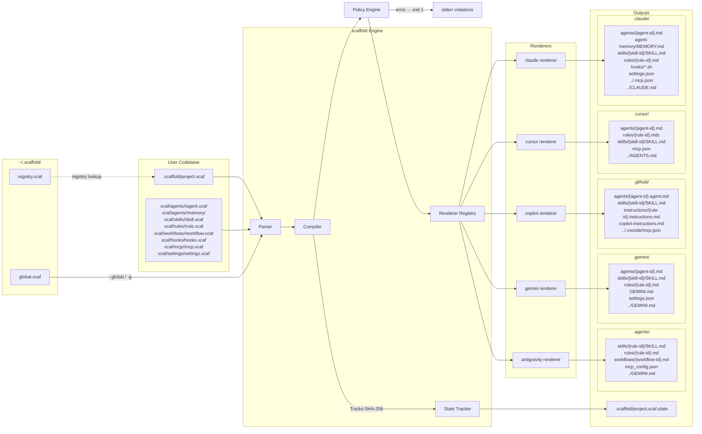

# Architecture Overview

`xcaffold` operates on a strictly deterministic, One-Way Compiler architecture for managing agent configurations across multiple platforms. It targets [multiple supported platforms](supported-providers.md) from a single `.xcaf` file.

---

## System Diagram



---

## Global Home (`~/.xcaffold/`)

Created automatically on first run by `registry.EnsureGlobalHome()`. Contains two seed files:

| File | Purpose |
|---|---|
| `global.xcaf` | User-wide agent config (uses `kind: global` for global-scope resources and settings) — auto-bootstrapped by scanning installed platform providers |
| `registry.xcaf` | YAML list of all registered projects (`name`, `path`, `targets`, `registered`, `last_applied`) |

`global.xcaf` is rebuilt by the registry package, which iterates a `globalProviders` registry containing the [supported platforms](../reference/supported-providers.md). During a scan, these providers read their specific configuration artifacts (e.g., skill directories, standalone global instructions) to bootstrap a multi-provider `.xcaf`.

> New providers are added by implementing a scan function and appending it to `globalProviders` in `internal/registry/registry.go`. No other changes are required.

---

### File Taxonomy (`kind:` Discriminator)

Every `.xcaf` file carries a `kind:` field as its first key. The parser reads this field before attempting full parsing to determine how the file should be processed:

| Kind value | Schema | Parser | Notes |
|---|---|---|---|
| `project` | `XcaffoldConfig` | `parser.ParseDirectory()` | Primary format. Exactly 1 required per project. Declares name, targets, resource refs. |
| `hooks` | `XcaffoldConfig` | `parser.ParseDirectory()` | Standalone hooks with `events:` wrapper |
| `settings` | `XcaffoldConfig` | `parser.ParseDirectory()` | Standalone settings |
| `global` | `XcaffoldConfig` | `parser.ParseDirectory()` | Global-scope resources and settings |
| `policy` (Preview) | `PolicyConfig` | `parseResourceDocument()` | Declarative constraint (standardized kind) |
| `registry` | `{kind, projects}` | `registry.readProjects()` | |

Every `.xcaf` file must declare an explicit `kind:` field. Files with unrecognized `kind:` values (like `registry`) are silently skipped by the directory scanner — this prevents non-config files from crashing the strict `KnownFields(true)` parser.

---

## Internal Package Map

| Package | Path | Role |
|---|---|---|
| `ast` | `internal/ast/` | Core types: `ResourceScope` (shared resource block), `XcaffoldConfig`, `*ProjectConfig`, and all resource configs |
| `parser` | `internal/parser/` | Strict YAML parsing — unknown fields fail immediately |
| `policy` | `internal/policy/` | Post-compile constraint engine -- evaluates built-in and user-defined policies against AST snapshot and compiled output |
| `compiler` | `internal/compiler/` | Routes AST to the correct renderer; exposes `Compile()` and `OutputDir()` |
| `renderer` | `internal/renderer/` | `TargetRenderer` interface, `Orchestrate()` per-resource dispatcher, `CapabilitySet`, `FidelityNote`, model resolution, shared helpers; all per-provider render logic lives here |
| `renderer/shared` | `internal/renderer/shared/` | Cross-renderer helpers (`LowerWorkflows`) that cannot live in the root renderer package due to import cycles |
| `importer` | `internal/importer/` | `ProviderImporter` interface — symmetric to `TargetRenderer`; detects and dispatches to provider implementations; all per-provider import logic lives here |
| `output` | `internal/output/` | `Output` struct — `map[relPath]content` file map |
| `state` | `internal/state/` | SHA-256 `.xcaffold/project.xcaf.state` generation, read, and write |
| `registry` | `internal/registry/` | Global home bootstrap, project registry CRUD, platform provider scans |
| `templates` | `internal/templates/` | Rendering templates for references and boilerplate generation |
| `analyzer` | `internal/analyzer/` | Detects undeclared artifacts via `ScanOutputDir` |
| `blueprint` | `internal/blueprint/` | Resolves `extends:` chains for blueprints via set-union merge across all resource ref-lists; errors on circular references or chains exceeding depth limit |
| `translator` | `internal/translator/` | `TranslateWorkflow()` lowers `WorkflowConfig` to provider primitives |
| `optimizer` | `internal/optimizer/` | Post-compile transformation pipeline for `xcaffold translate` and `xcaffold apply` — 7 named passes (`flatten-scopes`, `inline-imports`, `dedupe`, `extract-common`, `prune-unused`, `normalize-paths`, `split-large-rules`); required passes prepended per-target |
| `resolver` | `internal/resolver/` | Resolves `instructions-file:` and `references:` relative paths |
| `generator` | `internal/generator/` | Anthropic API calls for scaffold generation; outputs `audit.json` |
| `judge` | `internal/judge/` | LLM-as-a-Judge evaluation against agent assertions |
| `proxy` | `internal/proxy/` | HTTP intercept proxy (retained; not currently used by `xcaffold test`) |
| `trace` | `internal/trace/` | Concurrent-safe JSONL execution trace recording |
| `auth` | `internal/auth/` | Authentication helpers for CLI-to-API flows |
| `llmclient` | `internal/llmclient/` | Provider-agnostic LLM HTTP client (Anthropic API + `claude` CLI); used by `xcaffold test` for direct API simulation |
| `prompt` | `internal/prompt/` | Interactive terminal prompt helpers (e.g. `Confirm()`) |
| `integration` | `internal/integration/` | Integration test utilities |

---

## Compilation Output Structure

```
<target_dir>/
├── .claude/
│   ├── agents/
│   │   ├── developer.md
│   │   └── cto.md
│   ├── skills/
│   │   └── git-workflow/
│   │       └── SKILL.md
│   ├── rules/
│   │   └── code-review.md
│   ├── settings.json
│   └── mcp.json
├── .cursor/
│   ├── rules/                 ← Agents are compiled as rule files
│   │   └── developer.mdc
│   ├── skills/
│   │   └── git-workflow/
│   │       └── SKILL.md
│   ├── hooks.json
│   └── mcp.json
└── .agents/                   ← (Antigravity target)
    ├── workflows/
    │   └── publish.md
    ├── skills/
    │   └── git-workflow/
    │       └── SKILL.md
    ├── rules/
    │   └── code-review.md
    └── mcp_config.json
```

---

## CLI Lifecycle: The 8-Phase Orchestration Engine

**Available commands:**

```
Bootstrap    → xcaffold init
Ingestion    → xcaffold import    (import provider configs into xcaf project)
Topology     → xcaffold graph     (ASCII / mermaid / DOT / JSON output)
Listing      → xcaffold list      (View registered projects)
Compilation  → xcaffold apply     (XCAF → policy evaluation → target output files + .xcaffold/project.xcaf.state)
Drift Check  → xcaffold diff      (compares .xcaffold/project.xcaf.state against live output files)
Validation   → xcaffold validate  (Syntax/structural check)
```

> **Preview.** The following commands are available as previews and may change before the stable release:

```
Audit        → xcaffold analyze   (LLM-based repo audit)
Migration    → xcaffold migrate   (Upgrade project layouts)
Review       → xcaffold review    (Terminal-based diagnostic viewing)
Simulation   → xcaffold test      (API simulation: reads compiled agent prompt, sends task to LLM, records declared tool calls)
Export       → xcaffold export    (packages compiled output as a distributable plugin)
```

---

## Related

- [Intermediate Representation (IR)](intermediate-representation.md) — What the AST looks like between parse and compile
- [Internal: BIR Architecture](translation-pipeline.md) — Internal compiler intermediate representation (not user-facing)
- [Declarative Compilation](../configuration/declarative-compilation.md) — Why one-way output is enforced
- [Multi-Target Rendering](multi-target-rendering.md) — Detailed explanation of the renderer interface and per-target output differences
- [Drift Detection and State](state-and-drift.md) — State file generation, SHA-256 hashing, and drift repair