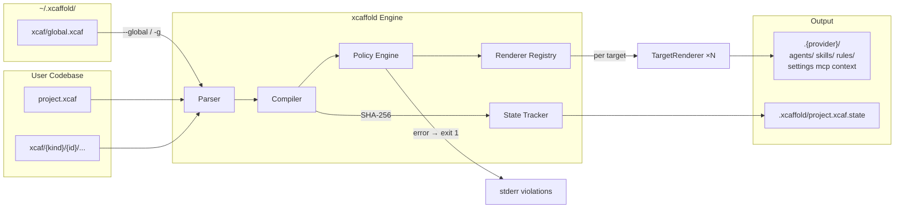

# Architecture Overview

`xcaffold` operates on a strictly deterministic, One-Way Compiler architecture for managing agent configurations across multiple platforms. It is an Agent Configuration Toolchain that implements the Harness-as-Code approach: the complete agent harness is declared in `.xcaf` manifests and compiled to native provider formats. It targets [multiple supported platforms](../../reference/supported-providers.md) from a single `.xcaf` file.

---

## System Diagram



Each target declared in `project.xcaf` dispatches to a registered `TargetRenderer`. The renderer produces provider-native output in `.{provider}/`. See [Multi-Target Rendering](multi-target-rendering.md) for per-provider output details.

---

## Global Home (`~/.xcaffold/`)

Created automatically on first run by `registry.EnsureGlobalHome()`. Contains:

| Path | Purpose |
|---|---|
| `xcaf/global.xcaf` | User-wide agent config (uses `kind: global` for global-scope resources and settings) |
| `xcaf/agents/` | Global agent definitions |
| `xcaf/skills/` | Global skill definitions |
| `xcaf/rules/` | Global rule definitions |
| `state/` | Compilation state for global scope |
| `registry.xcaf` | Project registry (tracks all managed projects) |

Each provider registers a `ProviderManifest` (including a `GlobalScanner` function) via `providers.Register()` in its `init()`. Each scanner discovers platform-specific configuration artifacts and writes them into `global.xcaf`.

> New providers are added by implementing a `GlobalScanner` function, including it in a `ProviderManifest`, and calling `providers.Register()`. No changes to the core package are required.

---

### File Taxonomy (`kind:` Discriminator)

Every `.xcaf` file carries a `kind:` field as its first key. The parser reads this field to determine how the file is processed:

| Kind | Category | Config Type | Notes |
|---|---|---|---|
| `project` | Project | `XcaffoldConfig` | Primary. Exactly 1 per project. |
| `hooks` | Project | `XcaffoldConfig` | Standalone hooks with `events:` wrapper |
| `settings` | Project | `XcaffoldConfig` | Standalone settings |
| `global` | Project | `XcaffoldConfig` | Global-scope resources (`~/.xcaffold/xcaf/global.xcaf`) |
| `agent` | Resource | `AgentConfig` | Agent definition |
| `skill` | Resource | `SkillConfig` | Skill with steps and references |
| `rule` | Resource | `RuleConfig` | Behavioral rule |
| `workflow` | Resource | `WorkflowConfig` | Multi-step automation |
| `mcp` | Resource | `MCPConfig` | MCP server definition |
| `context` | Resource | `ContextConfig` | Project instructions |
| `memory` | Resource | `MemoryConfig` | Agent memory content |
| `blueprint` | Composition | `BlueprintConfig` | Merges resource ref-lists via `extends:` |
| `policy` | Constraint | `PolicyConfig` | Declarative constraint (Preview) |

Project kinds are parsed by `parser.ParseDirectory()`. Resource and constraint kinds are parsed by `parseResourceDocument()`. Blueprints are parsed by `parseBlueprintDocument()`. Every `.xcaf` file must declare an explicit `kind:` field.

---

## Internal Package Map

| Package | Path | Role |
|---|---|---|
| `ast` | `internal/ast/` | Core types: `ResourceScope` (shared resource block), `XcaffoldConfig`, `*ProjectConfig`, and all resource configs |
| `parser` | `internal/parser/` | Strict YAML parsing — unknown fields fail immediately |
| `policy` | `internal/policy/` | Post-compile constraint engine -- evaluates built-in and user-defined policies against AST snapshot and compiled output |
| `compiler` | `internal/compiler/` | Routes AST to the correct renderer; exposes `Compile()` and `OutputDir()` |
| `renderer` | `internal/renderer/` | `TargetRenderer` interface, `Orchestrate()` per-resource dispatcher, `CapabilitySet`, `FidelityNote`, model resolution, shared helpers; per-provider implementations live in `providers/` |
| `renderer/shared` | `internal/renderer/shared/` | Cross-renderer helpers (`LowerWorkflows`) that cannot live in the root renderer package due to import cycles |
| `importer` | `internal/importer/` | `ProviderImporter` interface — symmetric to `TargetRenderer`; detects and dispatches to per-provider implementations in `providers/` |
| `output` | `internal/output/` | `Output` struct — `map[relPath]content` file map |
| `state` | `internal/state/` | SHA-256 `.xcaffold/project.xcaf.state` generation, read, and write |
| `templates` | `internal/templates/` | Embedded scaffolding templates (`agents/`, `rules/`, `skills/`) for `xcaffold init` project bootstrap |
| `analyzer` | `internal/analyzer/` | `ScanOutputDir` (undeclared artifact detection) and `ScanProject` (project signature extraction for `generator`) |
| `blueprint` | `internal/blueprint/` | Resolves `extends:` chains for blueprints via set-union merge across all resource ref-lists; errors on circular references or chains exceeding depth limit |
| `translator` | `internal/translator/` | `TranslateWorkflow()` lowers `WorkflowConfig` to provider primitives |
| `optimizer` | `internal/optimizer/` | Post-compile transformation pipeline for `xcaffold apply` — 7 named passes (`flatten-scopes`, `inline-imports`, `dedupe`, `extract-common`, `prune-unused`, `normalize-paths`, `split-large-rules`); required passes prepended per-target |
| `resolver` | `internal/resolver/` | Resolves `instructions-file:` and `references:` relative paths |
| `generator` | `internal/generator/` | LLM-powered scaffold generation via `llmclient`; analyzes project signature and outputs xcaffold configuration |
| `auth` | `internal/auth/` | `AuthMode` type and constants — `api_key`, `generic_api`, `subscription` — shared across LLM-consuming packages |
| `llmclient` | `internal/llmclient/` | Provider-agnostic LLM HTTP client — Anthropic API, OpenAI-compatible API, or local CLI subprocess; shared by `generator` |
| `prompt` | `internal/prompt/` | Interactive terminal prompts — `Ask()`, `Confirm()`, `MultiSelect()` — built on `charmbracelet/huh` |
| `integration` | `internal/integration/` | Cross-package integration tests (real-data schema validation, API simulation, memory lifecycle) |

> Per-provider rendering and import implementations live in `providers/{name}/` (one directory per target), not in `internal/`. The `internal/renderer/` and `internal/importer/` packages define the interfaces and shared dispatch logic.

---

## Compilation Output Structure

Each target in `project.xcaf` produces an output directory following the provider's conventions:

```
.{provider}/
├── agents/{agent-id}.md
├── skills/{skill-id}/SKILL.md
├── rules/{rule-id}.md
├── settings.json
├── mcp.json
└── {context file}.md
.xcaffold/
└── project.xcaf.state
```

File extensions, directory layout, and supported resource kinds vary by provider. The `TargetRenderer` interface and `CapabilitySet` determine the exact output for each target. See [Multi-Target Rendering](multi-target-rendering.md) for per-provider output structure and capability matrices.

---

## CLI Command Reference

**Stable commands:**

```
Bootstrap    → xcaffold init       (create new xcaffold project)
Ingestion    → xcaffold import     (import provider configs into xcaf project)
Topology     → xcaffold graph      (ASCII / Mermaid / DOT / JSON output)
Compilation  → xcaffold apply      (xcaf → policy evaluation → target output files)
Drift Check  → xcaffold status     (compare state against live output files)
Validation   → xcaffold validate   (syntax/structural check)
Listing      → xcaffold list       (list resources and blueprints)
```

---

## Related

- [Intermediate Representation (IR)](intermediate-representation.md) — What the AST looks like between parse and compile
- [Internal: BIR Architecture](translation-pipeline.md) — Internal compiler intermediate representation (not user-facing)
- [Declarative Compilation](../configuration/declarative-compilation.md) — Why one-way output is enforced
- [Multi-Target Rendering](multi-target-rendering.md) — Detailed explanation of the renderer interface and per-target output differences
