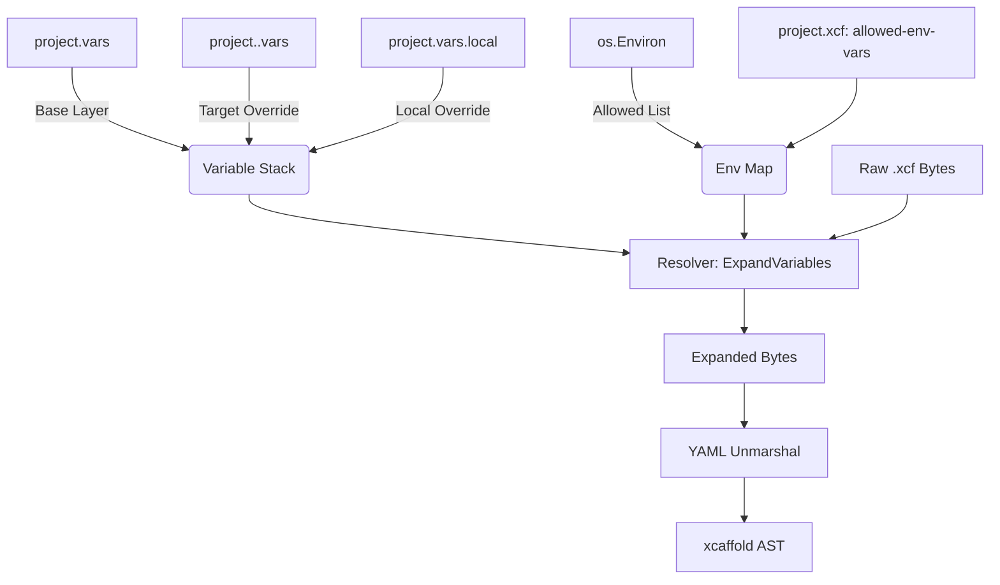

# Project Variables

Project Variables provide a deterministic, text-level substitution layer that resolves user-defined constants and environment variables into `.xcf` manifests before the YAML AST is constructed. 

Variables enable DRY (Don't Repeat Yourself) manifest authoring by extracting shared values—like organization names, model preferences, and base paths—into a single source of truth, reducing duplication across large agentic frameworks.

---

## The Core Mechanism

The variable system operates on a tiered resolution model and a pre-parse expansion pipeline.

1. **Discovery & Layering**: When `xcaffold apply` (or any read command) scans the `xcf/` directory, it first searches for variable files. It loads the base `project.vars`, layers any target-specific overrides like `project.claude.vars`, and finally applies developer-specific local overrides from `project.vars.local`.
2. **Environment Filtering**: Concurrently, the compiler reads the `allowed-env-vars` list from `project.xcf` and extracts only those specific keys from the runtime environment.
3. **Pre-Parse Expansion**: As the parser processes each `.xcf` file, it performs a regex-based substitution on the raw byte stream, replacing `${var.name}` and `${env.NAME}` tokens with their concrete values.
4. **Type Preservation**: Variables injected into the YAML stream retain their native YAML types (string, boolean, integer, list) during the `yaml.Unmarshal` phase, preserving structural integrity. Variable values themselves can also contain references to other variables (composition), which are resolved recursively by the parser.

---

## Design Decisions

**Pre-Parse Resolution vs. AST Traversal**
We chose to expand variables at the raw text level *before* YAML parsing, rather than resolving them during the AST traversal phase (which is how `${agent.id.field}` cross-references work). This design ensures that downstream compiler logic, such as policy enforcement and optimization passes, only ever sees literal values. It prevents the AST from being polluted with unresolved tokens and simplifies the compiler pipeline.

**Properties-Style Syntax over YAML**
Variable files use a simple `key = value` assignment syntax rather than standard YAML (`key: value`). This creates a clear visual distinction between defining a constant in a `.vars` file and defining a manifest field in a `.xcf` file, reducing cognitive load for authors.

**Explicit Environment Allow-Lists**
Environment variables are powerful but pose a security risk if a malicious blueprint attempts to exfiltrate system secrets via `${env.AWS_ACCESS_KEY_ID}`. We mandate that all accessible environment variables be explicitly declared in the `project.xcf` `allowed-env-vars` array, establishing a secure perimeter around the compilation context.

**Flexible Naming Conventions**
Variable names are not restricted to kebab-case. Authors are free to use `snake_case`, `camelCase`, or `PascalCase` to match their team's preferences. Names must simply start with a letter or underscore and contain only alphanumeric characters, underscores, or hyphens (`^[a-zA-Z][_a-zA-Z0-9-]*$`).

---

## Interaction with Other Concepts

- **[Multi-Target Compilation](../architecture/multi-target-rendering.md)**: The variable system's tiering mechanism integrates deeply with the compiler's target flags. When compiling for `claude`, `project.claude.vars` is automatically injected, allowing providers to share a common manifest structure while receiving distinct runtime parameters (like model IDs).
- **[State & Drift](../execution/state-and-drift.md)**: The variable stack (`project.vars` and `project.<target>.vars`) is tracked in the project state file (`.xcaffold/*.xcf.state`). Modifying a shared variable automatically invalidates the cache for all dependent compiled outputs, triggering a full recompilation on the next `apply`.

---

## When This Matters

- **Managing Environments**: When deploying agent configurations across multiple environments (development, staging, production), teams can use the `--var-file` CLI flag to inject environment-specific constants without altering the core `.xcf` manifests.
- **Provider-Specific Tuning**: When a workflow must run on both Claude and Gemini, but requires different timeout thresholds or model aliases for each, authors can declare those differences in `project.claude.vars` and `project.gemini.vars` while maintaining a single `workflow.xcf` file.
- **Local Development Secrets**: Developers can use the gitignored `project.vars.local` file to inject personal API keys or test values during local `xcaffold test` runs without risking a commit leak.

## Related

- [CLI Reference](../reference/cli.md) — details on the `--var-file` flag
- [Schema Reference](../reference/schema.md) — details on `allowed-env-vars`
