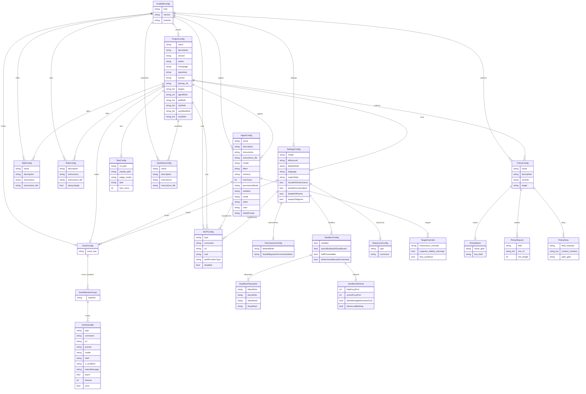

# Schema Reference

Exhaustive reference for the `.xcf` YAML configuration schema. Every field is verified against `internal/ast/types.go`.

> **Parsing**: Xcaffold uses a strict, fail-closed YAML parser (`KnownFields(true)`). Unknown fields cause an immediate parse error. All filesystem paths are resolved via `filepath.Clean()` — `..` traversal is rejected.

**Type conventions:**
- `*bool` / `*int` — A pointer type. When omitted from YAML, the field is `nil` (inherits platform default). When explicitly set to `false` / `0`, it overrides the default. This distinction matters: omitting a `*bool` field is **not** the same as setting it to `false`.
- `any` — A free-form value passed through to the target platform's settings file unchanged. Xcaffold does not validate the contents.

---

## Schema Architecture

The following diagram shows the structural relationships between the major types in the `.xcf` schema. Cardinality is shown as `||--o{` (one to zero-or-many) and `||--o|` (one to zero-or-one).



## Supported Kinds

The `kind` field is the document type discriminator. Each `.xcf` file (or YAML document within a multi-document file) declares its kind. Multiple documents of different kinds can coexist in a single file, separated by `---`.

| Kind | Description | Decode struct | Required fields |
|---|---|---|---|
| `project` | Project manifest. Declares the project name, compilation targets, and child resource references as bare name lists (`agents: [dev, qa]`). Exactly one per project. | `projectDocFields` | `version`, `name` |
| `global` | Global-scope configuration for `~/.xcaffold/global.xcf`. Contains resources and settings without project metadata. | `XcaffoldConfig` (direct) | `version` |
| `policy` | Declarative constraint evaluated against AST and compiled output during `apply` and `validate`. | `PolicyConfig` (with envelope) | `version`, `name` |
| `agent` | Standalone agent definition. All `AgentConfig` fields at the top level. | `AgentConfig` (with envelope) | `version`, `name` |
| `skill` | Standalone skill definition. All `SkillConfig` fields at the top level. | `SkillConfig` (with envelope) | `version`, `name` |
| `rule` | Standalone rule definition. All `RuleConfig` fields at the top level. | `RuleConfig` (with envelope) | `version`, `name` |
| `workflow` | Standalone workflow definition. All `WorkflowConfig` fields at the top level. | `WorkflowConfig` (with envelope) | `version`, `name` |
| `mcp` | Standalone MCP server definition. All `MCPConfig` fields at the top level. | `MCPConfig` (with envelope) | `version`, `name` |
| `hooks` | Standalone hooks definition. Uses an `events:` wrapper containing the `HookConfig` map. | `hooksDocument` | `version` |
| `settings` | Standalone settings definition. All `SettingsConfig` fields at the top level (inlined). | `settingsDocument` | `version` |
| `policy` | Standalone policy definition. Declarative constraint evaluated during `apply` and `validate`. Semantic validation enforces `severity` (`error`/`warning`/`off`) and `target` (`agent`/`skill`/`rule`/`hook`/`settings`/`output`) enums. | `PolicyConfig` (with envelope) | `version`, `name` |

### `kind: project` semantics

In `kind: project` documents, the `agents`, `skills`, `rules`, `workflows`, `mcp`, and `policies` keys are decoded as `[]string` (bare name lists), not as the `map[string]Config` inline definition structures used in other document kinds. This is achieved via a separate decode struct (`projectDocFields`) that maps these YAML keys to `AgentRefs`, `SkillRefs`, `RuleRefs`, `WorkflowRefs`, `MCPRefs`, and `PolicyRefs` on `ProjectConfig`. These reference lists name child resources defined in sibling documents (same file via `---` separators, or separate `.xcf` files in the `xcf/` directory).

The `targets` key on `kind: project` is also a `[]string` listing compilation targets (e.g., `["claude", "antigravity"]`). It is stored on `ProjectConfig.Targets` (tagged `yaml:"-"` — only populated by the parser for `kind: project` documents).

### Multi-document files

A single `.xcf` file can contain multiple YAML documents separated by `---`. The parser decodes each document independently based on its `kind` and merges the results into a single `XcaffoldConfig`. This enables a self-contained project definition:

```yaml
kind: project
version: "1.0"
name: my-app
agents:
  - developer
---
kind: agent
version: "1.0"
name: developer
model: sonnet
instructions: |
  You are a developer.
```

See [examples/multi-kind.xcf](examples/multi-kind.xcf) for a complete example.

---

## Scopes

Xcaffold operates at two scopes, selected via the `--global / -g` flag.

| | Global (`-g`) | Project (default) |
|---|---|---|
| **Config dir** | `~/.xcaffold/` | Project root (`./`) |
| **Primary file** | `~/.xcaffold/global.xcf` | `./scaffold.xcf` |
| **Lock file** | `~/.xcaffold/scaffold.<target>.lock` | `./scaffold.<target>.lock` |
| **Compiled output** | `~/.claude/`, `~/.cursor/`, `~/.agents/` | `./.claude/`, `./.cursor/`, `./.agents/` |
| **Represents** | User-wide personal agent configuration | A specific codebase's agent setup |
| **Has `project:` block** | **No** — it is a user profile, not a project | **Yes** |
| **Has `test:`** | No | Yes |
| **Has `settings:`** | Yes — user-level defaults | Yes — project-level overrides |
| **Has `extends:`** | No — it is the root config | Yes — may declare `extends: "path/to/base.xcf"` |

### Implicit Global Inheritance

When evaluating a project configuration, xcaffold implicitly loads `~/.xcaffold/` first as a base layer. 

- **Cross-reference validation** — an agent in the project can reference a skill defined globally without a parse error.
- **Visualization** — `xcaffold graph` automatically shows both inherited global resources and the local project resources.

> [!IMPORTANT]
> Because global configs are aggregated implicitly, you do **not** need to declare `extends: global` in your project's `.xcf` file.
> 
> Furthermore, during compilation (`xcaffold apply`), global resources are securely stripped from the AST. They are **not** physically copied into the project's compiled output directory (like `.claude/`). Global resources are already natively available to agentic runtimes independently (compiled separately via `xcaffold apply -g`). Duplication into project directories would create conflicting clones.

### Running both scopes

Global and project scopes are fully independent compilations. To compile both:

```bash
xcaffold apply -g   # compile ~/.xcaffold/global.xcf → ~/.claude/
xcaffold apply      # compile ./scaffold.xcf → ./.claude/
```

There is no `--all` flag — the two commands are independent (different sources, outputs, lock files) with no atomicity guarantee.

---

## `XcaffoldConfig`

Root structure of a parsed `.xcf` file. Used at both project scope (`./scaffold.xcf`) and global scope (`~/.xcaffold/global.xcf`). See [Scopes](#scopes) for field applicability at each level.

| Field | Type | Required | Description |
|---|---|---|---|
| `kind` | `string` | **Required** | Document type discriminator. See [Supported Kinds](#supported-kinds) for the full list. Non-config files (e.g. `registry.xcf`) use `kind: registry` and are skipped by the directory scanner. |
| `version` | `string` | **Required** | Schema version. Current: `"1.0"`. |
| `project` | `*ProjectConfig` | Project scope only | Project-level metadata and workspace-scoped resources. `nil` for global configs. |
| `extends` | `string` | Optional (project only) | Path to a parent `.xcf` config. Use `"global"` to reference `~/.xcaffold/global.xcf` for validation and visualization. Does not affect compiled output. |
| `agents` | `map[string]AgentConfig` | Optional | Agent persona declarations keyed by ID. Provided via embedded `ResourceScope`. |
| `skills` | `map[string]SkillConfig` | Optional | Reusable prompt packages keyed by ID. Provided via embedded `ResourceScope`. |
| `rules` | `map[string]RuleConfig` | Optional | Path-gated formatting guidelines keyed by ID. Provided via embedded `ResourceScope`. |
| `hooks` | `HookConfig` | Optional | Lifecycle event handlers. Provided via embedded `ResourceScope`. |
| `mcp` | `map[string]MCPConfig` | Optional | MCP server definitions. Merged into `settings.mcpServers` during compilation; `settings.mcpServers` wins on key conflicts. Provided via embedded `ResourceScope`. |
| `workflows` | `map[string]WorkflowConfig` | Optional | Reusable workflows keyed by ID. **Antigravity-only**: silently ignored by Claude and Cursor renderers. Provided via embedded `ResourceScope`. |
| `policies` | `map[string]PolicyConfig` | Optional | Declarative constraints keyed by ID. Evaluated during `apply` and `validate`. Provided via embedded `ResourceScope`. |
| `settings` | `SettingsConfig` | Optional | Platform settings compiled to `settings.json`. At global scope, these become user-level defaults. |

---

## `ProjectConfig`

Project-level metadata and workspace-scoped resources. Present **only** in project-scope configs (`scaffold.xcf`). Global config (`global.xcf`) is a user profile, not a project — it has no `project:` block. In addition to metadata, `project:` holds workspace-scoped resource declarations (`agents`, `skills`, `rules`, `hooks`, `mcp`, `workflows`, `policies`) and project-only settings (`test`, `local`) that are not valid at global scope.

> [!NOTE]
> `project.name` is required in `scaffold.xcf`. It is used to register the project in `~/.xcaffold/registry.xcf`, prefix lock file entries, and label graph and plan output. It has no equivalent at global scope.

| Field | Type | Required | Description |
|---|---|---|---|
| `name` | `string` | **Required** | Canonical project name. Used in registry, graph output, and generated comments. |
| `description` | `string` | Optional | Human-readable project description. |
| `version` | `string` | Optional | Project version for tracking purposes. |
| `author` | `string` | Optional | Maintainer identifier. |
| `homepage` | `string` | Optional | Project URL. |
| `repository` | `string` | Optional | Source control URL. |
| `license` | `string` | Optional | SPDX license identifier. |
| `backup_dir` | `string` | Optional | Directory for `xcaffold apply --backup` output. Defaults to `.<target>_bak_<timestamp>` in the project root. |
| `targets` | `[]string` | Optional | Compilation targets (e.g., `["claude", "antigravity"]`). Only populated via `kind: project` documents — tagged `yaml:"-"`. |
| `agentRefs` | `[]string` | Optional | Bare name references to child agent resources. Only populated via `kind: project` documents. |
| `skillRefs` | `[]string` | Optional | Bare name references to child skill resources. Only populated via `kind: project` documents. |
| `ruleRefs` | `[]string` | Optional | Bare name references to child rule resources. Only populated via `kind: project` documents. |
| `workflowRefs` | `[]string` | Optional | Bare name references to child workflow resources. Only populated via `kind: project` documents. |
| `mcpRefs` | `[]string` | Optional | Bare name references to child MCP resources. Only populated via `kind: project` documents. |
| `policyRefs` | `[]string` | Optional | Bare name references to child policy resources. Only populated via `kind: project` documents. |
| `test` | `TestConfig` | Optional | Configuration for `xcaffold test`. See [TestConfig](#testconfig). |
| `local` | `SettingsConfig` | Optional | Local override settings compiled to `settings.local.json` (gitignored). |
| `agents` | `map[string]AgentConfig` | Optional | Workspace-scoped agent declarations. Override global agents with the same ID. |
| `skills` | `map[string]SkillConfig` | Optional | Workspace-scoped skill declarations. |
| `rules` | `map[string]RuleConfig` | Optional | Workspace-scoped rule declarations. |
| `hooks` | `HookConfig` | Optional | Workspace-scoped lifecycle hooks. Additive with global hooks. |
| `mcp` | `map[string]MCPConfig` | Optional | Workspace-scoped MCP server definitions. |
| `workflows` | `map[string]WorkflowConfig` | Optional | Workspace-scoped workflow declarations. |
| `policies` | `map[string]PolicyConfig` | Optional | Workspace-scoped policy declarations. Evaluated during `apply` and `validate`. |

---

## `AgentConfig`

Defines an agent persona. Compiled to `agents/<id>.md` with YAML frontmatter.

Fields are declared (and serialized) in a canonical order grouped by purpose. The same ordering is emitted in compiled markdown frontmatter and in files generated by `xcaffold init`.

**Identity**

| Field | Type | Required | Description |
|---|---|---|---|
| `name` | `string` | Optional | Display name. Defaults to the map key if omitted. |
| `description` | `string` | Optional | Brief explanation of the agent's purpose. Used for delegation and auto-invocation. |

**Model & Execution**

| Field | Type | Required | Description |
|---|---|---|---|
| `model` | `string` | Optional | LLM model identifier. Supports aliases (`sonnet-4`, `opus-4`, `haiku-3.5`) which are resolved per-target by the model resolver. |
| `effort` | `string` | Optional | Resource utilization level (`"low"`, `"medium"`, `"high"`, `"max"`). |
| `maxTurns` | `int` | Optional | Maximum conversation turns before the agent stops. |
| `mode` | `string` | Optional | Agent execution mode. |

**Tool Access**

| Field | Type | Required | Description |
|---|---|---|---|
| `tools` | `[]string` | Optional | Runtime tools granted to the agent (e.g., `Bash`, `Read`, `Write`, `Edit`, `Glob`, `Grep`). Omit to inherit all available tools. |
| `disallowedTools` | `[]string` | Optional | Tools the agent is explicitly forbidden from using. Applied before `tools` resolution. |
| `readonly` | `*bool` | Optional | When `true` and `tools` is empty, the Claude renderer emits `tools: [Read, Grep, Glob]`; Cursor and Antigravity emit `readonly: true` natively. |

**Permissions & Invocation Control**

| Field | Type | Required | Description |
|---|---|---|---|
| `permissionMode` | `string` | Optional | Default execution permission mode. Values: `default`, `acceptEdits`, `auto`, `dontAsk`, `bypassPermissions`, `plan`. |
| `disableModelInvocation` | `*bool` | Optional | When `true`, the host model must not auto-invoke this agent. Users can still invoke it explicitly. |
| `userInvocable` | `*bool` | Optional | When `false`, the agent is accessible only programmatically (not from a UI picker). |

**Lifecycle**

| Field | Type | Required | Description |
|---|---|---|---|
| `background` | `*bool` | Optional | Execute without blocking the UI. Emitted as `background` for Claude, `is_background` for Cursor and Antigravity. |
| `isolation` | `string` | Optional | Worktree or environment isolation preference. |
| `when` | `string` | Optional | Compile-time conditional for inclusion. |

**Memory & Context**

| Field | Type | Required | Description |
|---|---|---|---|
| `memory` | `string` | Optional | Agent memory scope. Values: `user`, `project`, `local`. |
| `color` | `string` | Optional | Terminal UI color attribute. |
| `initialPrompt` | `string` | Optional | Default message auto-submitted as the first turn. |

**Composition References**

| Field | Type | Required | Description |
|---|---|---|---|
| `skills` | `[]string` | Optional | Skill IDs to grant. Must match top-level `skills:` map keys. |
| `rules` | `[]string` | Optional | Rule IDs the agent must follow. Must match top-level `rules:` map keys. |
| `mcp` | `[]string` | Optional | MCP server IDs to load. Must match top-level `mcp:` map keys. |
| `assertions` | `[]string` | Optional | Behavioral constraints evaluated by `xcaffold test --judge`. |

**Inline Composition**

| Field | Type | Required | Description |
|---|---|---|---|
| `mcpServers` | `map[string]MCPConfig` | Optional | Agent-scoped MCP server definitions (not merged with top-level `mcp:`). |
| `hooks` | `HookConfig` | Optional | Agent-scoped lifecycle hooks. |

**Multi-Target**

| Field | Type | Required | Description |
|---|---|---|---|
| `targets` | `map[string]TargetOverride` | Optional | Per-target overrides and provider-native pass-through fields. Keys are target names (`claude`, `cursor`, `antigravity`, `agentsmd`). See `TargetOverride` below. |

**Instructions** (always last)

| Field | Type | Required | Description |
|---|---|---|---|
| `instructions` | `string` | Optional | Inline Markdown prompt body. Mutually exclusive with `instructions_file`. |
| `instructions_file` | `string` | Optional | Path to a Markdown file containing the prompt body. Resolved relative to `scaffold.xcf` directory. Mutually exclusive with `instructions`. |

> [!WARNING]
> **Cursor**: Only `name`, `description`, `model`, `readonly`, and `background` (renamed to `is_background`) are emitted. All other fields — `effort`, `tools`, `disallowedTools`, `skills`, `rules`, `permissionMode`, `isolation`, `color`, `initialPrompt`, `memory`, `maxTurns`, `hooks`, `mcpServers` — are silently dropped. Unmapped `model` values emit a stderr warning and are omitted.
>
> **Antigravity**: Antigravity has **no file-based agent configuration**. Agent behavior is controlled entirely via UI settings and conversation-level mode selection. xcaffold **cannot compile agents for Antigravity** — the target is skipped with a warning.
>
> **AgentsMD**: Only `name`, `description`, `model`, and instruction body are preserved. All other fields emit fidelity warnings and are dropped.

---

## `TargetOverride`

Per-target compilation overrides. Used inside `agents.<id>.targets.<target>`.

Two concerns live here: xcaffold's own override mechanics (strictly validated) and the `provider` pass-through (opaque to the parser, interpreted by the target renderer).

**xcaffold override mechanics**

| Field | Type | Required | Description |
|---|---|---|---|
| `hooks` | `map[string]string` | Optional | Target-specific hook overrides. |
| `suppress_fidelity_warnings` | `*bool` | Optional | When `true`, suppresses stderr warnings about dropped fields for this target. |
| `skip_synthesis` | `*bool` | Optional | When `true`, skips synthesis for this target. |
| `instructions_override` | `string` | Optional | Replacement instruction prompt used instead of the agent's default `instructions`. |

**Provider-native pass-through**

| Field | Type | Required | Description |
|---|---|---|---|
| `provider` | `map[string]any` | Optional | Provider-native fields carried through to the target without parser validation. Each target renderer defines which keys it consumes. |

The `provider` block carries arbitrary keys — the parser does not validate them, which lets new provider fields be adopted without schema changes. Renderers validate and use their own keys and emit fidelity warnings for unknown values.

**Example:**

```yaml
agents:
  researcher:
    name: researcher
    model: sonnet-4
    targets:
      gemini:
        provider:
          temperature: 0.7
          timeout_mins: 15
          kind: local
```

---

## `SkillConfig`

Defines a reusable prompt package. Compiled to `skills/<id>/SKILL.md`.

| Field | Type | Required | Description |
|---|---|---|---|
| `name` | `string` | Optional | Display name for the skill. |
| `description` | `string` | Optional | Human-readable description. Shown in listings and help text. |
| `instructions` | `string` | Optional | Inline Markdown prompt body. Mutually exclusive with `instructions_file`. |
| `instructions_file` | `string` | Optional | Path to a Markdown file. Mutually exclusive with `instructions`. |
| `tools` | `[]string` | Optional | Tools required or relevant during skill execution. |
| `references` | `[]string` | Optional | Supporting files or glob patterns. Resolved relative to `scaffold.xcf`. Copied to `skills/<id>/references/` during compilation. |
| `scripts` | `[]string` | Optional | Executable helper files. Resolved relative to `scaffold.xcf`. Copied to `skills/<id>/scripts/` during compilation. |
| `assets` | `[]string` | Optional | Output artifact files like templates or icons. Resolved relative to `scaffold.xcf`. Copied to `skills/<id>/assets/` during compilation. |

> [!WARNING]
> **Cursor**: Script and asset bundling is not supported. Those directories are dropped during compilation with a standard stderr warning.
>
> **Antigravity**: Frontmatter fields beyond `name` and `description` are dropped.
>
> **AgentsMD**: Only instruction bodies and `description` are emitted.

---

## `RuleConfig`

Path-gated formatting guideline. Compiled to `rules/<id>.md` (Claude), `rules/<id>.mdc` (Cursor), or `rules/<id>.md` (Antigravity).

| Field | Type | Required | Description |
|---|---|---|---|
| `description` | `string` | Optional | Summary of the rule. |
| `instructions` | `string` | Optional | Inline rule content. Mutually exclusive with `instructions_file`. |
| `instructions_file` | `string` | Optional | Path to a Markdown file. Mutually exclusive with `instructions`. |
| `paths` | `[]string` | Optional | Glob patterns restricting where the rule applies (e.g., `["src/**/*.go"]`). |
| `alwaysApply` | `*bool` | Optional | When `true`, the rule applies globally regardless of `paths`. |

> [!NOTE]
> **Cursor normalization**: `paths` is emitted as `globs:` in `.mdc` frontmatter. Rules without `paths` automatically receive `alwaysApply: true`.
>
> **Antigravity normalization**: No YAML frontmatter is emitted. `description` becomes a `# heading`. `paths` and `alwaysApply` are dropped — Antigravity handles rule activation via UI. Bodies exceeding 12,000 characters receive a warning comment.
>
> **AgentsMD**: Rules with `paths` are grouped into directory-scoped `AGENTS.md` files. `alwaysApply` is dropped.

---

## Hooks

XCaffold hook syntax natively targets the following provider implementation standards:

* **Cursor**: [https://cursor.com/docs/hooks](https://cursor.com/docs/hooks)
* **Claude**: [https://code.claude.com/docs/en/hooks](https://code.claude.com/docs/en/hooks)
* **Antigravity**: Not natively supported but can be translated via `workflows` + `rules` (always on).

### Hook Locations & Configuration Scopes

When injecting hooks into respective AI agents, Xcaffold and the underlying providers apply specific file resolution hierarchies:

**Cursor Locations**:
Cursor resolves hooks directly from:
* `.cursor/hooks.json`

**Claude Locations**:
Claude supports resolving hooks from multiple layers depending on your intended scope:
* Global User Settings: `~/.claude/settings.json`
* Project Settings: `.claude/settings.json`
* Local Overrides: `.claude/settings.local.json`
* Plugin Hooks: `hooks/hooks.json`

**Xcaffold Aggregation**:
Xcaffold aggregates all `HookConfig` definitions across your `scaffold.xcf` inheritances and natively injects them into the correct location for your target provider. For Cursor, this is compiled exclusively to `.cursor/hooks.json`. For Claude, these are directly injected under the `"hooks"` key tightly coupled within `.claude/settings.json`, ensuring the `claude` CLI seamlessly picks them up without requiring plugin activation.

> [!NOTE]
> If you utilize `xcaffold plugin export` to bundle a custom Claude plugin, Xcaffold extracts these hook configurations out of `settings.json` and cleanly routes them to `hooks/hooks.json` to strictly comply with the Claude plugin specification payload format.

### `HookConfig`

`HookConfig` is a `map[string][]HookMatcherGroup`. Keys are lifecycle event names matching the supported execution phases. 

Supported hook events include: `SessionStart`, `SessionEnd`, `UserPromptSubmit`, `Stop`, `StopFailure`, `PreToolUse`, `PostToolUse`, `PostToolUseFailure`, `PermissionRequest`, `PermissionDenied`, `Notification`, `SubagentStart`, `SubagentStop`, `TaskCreated`, `TaskCompleted`, `TeammateIdle`, `InstructionsLoaded`, `ConfigChange`, `CwdChanged`, `FileChanged`, `WorktreeCreate`, `WorktreeRemove`, `PreCompact`, `PostCompact`, `Elicitation`, `ElicitationResult`.

```yaml
hooks:
  PreToolUse:                  # ← event name (map key)
    - matcher: "Bash"          # ← HookMatcherGroup
      hooks:                   # ← []HookHandler
        - type: command
          command: "echo 'before bash'"
```

### `HookMatcherGroup`

Groups hook handlers under a matcher pattern within an event.

| Field | Type | Required | Description |
|---|---|---|---|
| `matcher` | `string` | Optional | Pattern to match against the tool name (e.g., `"Bash"`, `"Write"`). If empty, the hooks fire for all tools. |
| `hooks` | `[]HookHandler` | **Required** | List of handlers to execute when the matcher matches. |

### `HookHandler`

A single executable hook action.

| Field | Type | Required | Description |
|---|---|---|---|
| `type` | `string` | **Required** | Handler type. Values: `command`, `http`, `prompt`, `agent`. |
| `command` | `string` | Optional | Shell command to execute (when `type: command`). |
| `url` | `string` | Optional | URL endpoint for webhook dispatch (when `type: http`). |
| `prompt` | `string` | Optional | LLM prompt to evaluate (when `type: prompt`). |
| `model` | `string` | Optional | LLM model for prompt hooks. |
| `shell` | `string` | Optional | Shell binary override (e.g., `/bin/bash` or `powershell`). |
| `if` | `string` | Optional | Conditional expression. Hook is skipped when the condition evaluates to false (e.g., `Bash(rm *)`). |
| `statusMessage` | `string` | Optional | Status text displayed in the UI while the hook runs. |
| `headers` | `map[string]string` | Optional | HTTP headers for `http`-type hooks (supports interpolation, e.g., Bearer `${API_KEY}`). |
| `allowedEnvVars` | `[]string` | Optional | Environment variables explicitly securely passed to the URL or command subprocess. |
| `async` | `*bool` | Optional | When `true`, the hook runs non-blocking in the background. |
| `timeout` | `*int` | Optional | Maximum execution time in seconds before the hook is killed. |
| `once` | `*bool` | Optional | When `true`, the hook fires only once per session. |

> [!WARNING]
> **Cursor normalization**: Event names are converted to camelCase (`PreToolUse` → `preToolUse`). The three-level structure (`event → matcher group → handlers`) is flattened to two levels (`event → handlers` with `matcher` injected as a field on each handler). `${...}` interpolation patterns emit a warning — Cursor requires `${env:NAME}` syntax. Handler types `http` and `agent` are silently dropped for Cursor — Cursor only supports `command` and `prompt` handlers.
>
> **Cursor-unique events**: Cursor supports additional hook events not in the Claude Code catalog: `beforeMCPExecution`, `afterMCPExecution`, `beforeShellExecution`, `afterShellExecution`, `afterAgentResponse`, `afterAgentThought`, `beforeTabFileRead`, `afterTabFileEdit`, `beforeSubmitPrompt`. Because `HookConfig` is a `map[string][]HookMatcherGroup`, these can be authored in a `.xcf` file and will compile correctly to `.cursor/hooks.json`. They are silently ignored when compiling for Claude.
>
> **Antigravity**: Hooks are silently skipped — Antigravity has no native hook system. Logic can be translated via workflows and always-on rules.
>
> **AgentsMD**: Hooks are dropped with fidelity warnings.

---

## `MCPConfig`

Defines a local or remote MCP (Model Context Protocol) server.

| Field | Type | Required | Description |
|---|---|---|---|
| `type` | `string` | Optional | Connection transport: `"stdio"` or `"sse"`. |
| `command` | `string` | Optional | Binary to spawn (for `stdio` transport). |
| `url` | `string` | Optional | Server endpoint URL (for `sse` transport). |
| `cwd` | `string` | Optional | Working directory for the spawned process. |
| `authProviderType` | `string` | Optional | Authentication method. |
| `args` | `[]string` | Optional | Command-line arguments for the spawned process. |
| `disabledTools` | `[]string` | Optional | Server-provided tools to mask. |
| `env` | `map[string]string` | Optional | Environment variables for the spawned process. |
| `headers` | `map[string]string` | Optional | HTTP headers for SSE connections. |
| `oauth` | `map[string]string` | Optional | OAuth authentication configuration. |
| `disabled` | `*bool` | Optional | When `true`, the server is defined but not loaded. |

> [!NOTE]
> **Claude**: MCP definitions from the top-level `mcp:` block are merged into `mcp.json`. `settings.mcpServers` takes precedence on key conflicts.
>
> **Cursor normalization**: `url` is emitted as `serverUrl`. The `type` field is omitted — Cursor infers transport from the presence of `command` (stdio) or `serverUrl` (http/sse). Output file: `.cursor/mcp.json`.
>
> **Env var interpolation**: Claude uses `${VAR_NAME}` syntax; Cursor uses `${env:VAR_NAME}` (and also `${userHome}`, `${workspaceFolder}`). xcaffold passes string values through verbatim — if you target both platforms from the same `.xcf` file, use the syntax for your primary target and document the difference for teams.
>
> **Antigravity normalization**: Compiled into `.agents/mcp_config.json` wrapped in an `mcpServers` block.

---

## `SettingsConfig`

Platform settings compiled to the target's settings file. The `local:` variant within `project:` compiles to a gitignored local override file.

> [!IMPORTANT]
> **Compilation target: Claude only.** xcaffold compiles `settings:` to `.claude/settings.json` and `project.local:` to `.claude/settings.local.json`. Cursor and Antigravity do not receive a compiled settings file — they configure equivalent concepts through UI panels or vendor-specific configuration.
>
> Many fields here represent **universal agentic concepts** (model selection, shell, environment variables, permissions, sandboxing) that every provider implements. The field definitions in xcaffold are provider-agnostic in meaning; only the compilation output is Claude-specific. Fields that are architecturally Claude-unique are noted per-row.
>
> **Security fields**: `permissions` and `sandbox` emit explicit stderr warnings when compiled for Cursor or Antigravity, since those platforms have no file-based enforcement mechanism. The warnings are: `"settings.permissions dropped — <target> has no permission enforcement"` and `"settings.sandbox dropped — <target> has no sandbox model"`.

| Field | Type | Required | Description |
|---|---|---|---|
| `model` | `string` | Optional | Default LLM model for the project. Resolved through the model alias system per-target. |
| `effortLevel` | `string` | Optional | Default effort level: `"high"`, `"medium"`, `"low"`. |
| `defaultShell` | `string` | Optional | Shell binary for command execution (e.g., `/bin/bash`). |
| `language` | `string` | Optional | UI language code (e.g., `"en"`, `"ja"`). |
| `outputStyle` | `string` | Optional | Terminal output format (e.g., `"markdown"`, `"plain"`). |
| `plansDirectory` | `string` | Optional | Directory for persistent plan files. |
| `autoMemoryDirectory` | `string` | Optional | Directory for auto-memory context persistence. |
| `otelHeadersHelper` | `string` | Optional | OpenTelemetry header mapping helper command. |
| `agent` | `any` | Optional | Default agent configuration. Passed through unchanged. |
| `worktree` | `any` | Optional | Worktree settings. Passed through unchanged. |
| `autoMode` | `any` | Optional | Autonomous mode settings. Passed through unchanged. |
| `cleanupPeriodDays` | `*int` | Optional | Days before orphaned data is garbage-collected. |
| `includeGitInstructions` | `*bool` | Optional | When `true`, injects standard Git workflow instructions. |
| `skipDangerousModePermissionPrompt` | `*bool` | Optional | When `true`, suppresses the dangerous-mode confirmation dialog. Claude Code–specific UX concept. |
| `autoMemoryEnabled` | `*bool` | Optional | When `true`, enables automatic context memory. |
| `disableAllHooks` | `*bool` | Optional | When `true`, globally disables all hook execution. |
| `attribution` | `*bool` | Optional | When `true`, adds attribution comments to generated code. |
| `disableSkillShellExecution` | `*bool` | Optional | When `true`, prevents skills from executing shell commands via `` !`cmd` `` syntax. Claude Code–specific. |
| `alwaysThinkingEnabled` | `*bool` | Optional | When `true`, forces extended thinking mode for all interactions. |
| `respectGitignore` | `*bool` | Optional | When `true`, excludes `.gitignore`-matched files from scanning. |
| `permissions` | `*PermissionsConfig` | Optional | Permission rules for tool access. |
| `sandbox` | `*SandboxConfig` | Optional | OS-level process isolation for Bash commands. |
| `statusLine` | `*StatusLineConfig` | Optional | Custom status bar configuration. Claude Code CLI–specific. |
| `hooks` | `HookConfig` | Optional | Settings-level lifecycle hooks. |
| `mcpServers` | `map[string]MCPConfig` | Optional | MCP server definitions (takes precedence over top-level `mcp:` on key conflicts). |
| `env` | `map[string]string` | Optional | Global environment variables. |
| `enabledPlugins` | `map[string]bool` | Optional | Plugin enable/disable toggles. Claude Code Plugin system–specific. |
| `availableModels` | `[]string` | Optional | Models available for user selection. |
| `claudeMdExcludes` | `[]string` | Optional | File patterns excluded from CLAUDE.md context file loading. Claude Code–specific. |


> [!IMPORTANT]
> **Claude only.** Settings are compiled to `settings.json` and `settings.local.json`. No other target renders settings. Cursor, Antigravity, and AgentsMD silently ignore the entire `settings:` and `local:` blocks.
>
> **Security fields**: `permissions` and `sandbox` emit explicit stderr warnings when compiled for Cursor or Antigravity, since those platforms have no enforcement mechanism. The warnings are: `"settings.permissions dropped — <target> has no permission enforcement"` and `"settings.sandbox dropped — <target> has no sandbox model"`.

---

## `PermissionsConfig`

Permission rules for tool access within `settings.permissions`. All three providers have the concept of allow/deny for tool operations — xcaffold expresses it here and compiles it to Claude's `settings.json`. Cursor and Antigravity apply equivalent rules via their UI settings panels.

| Field | Type | Required | Description |
|---|---|---|---|
| `allow` | `[]string` | Optional | Permitted tool operations (e.g., `"Bash(npm test *)"`, `"Read"`). |
| `deny` | `[]string` | Optional | Denied operations. Overrides `allow` when both match. |
| `ask` | `[]string` | Optional | Operations requiring interactive user confirmation. |
| `defaultMode` | `string` | Optional | Default permission mode for the session (e.g., `"default"`, `"acceptEdits"`, `"plan"`, `"auto"`). |
| `additionalDirectories` | `[]string` | Optional | Extra working directories the agent may access beyond the project root. |
| `disableBypassPermissionsMode` | `string` | Optional | When set to `"disable"`, blocks the bypass permissions mode org-wide. |

---

## `SandboxConfig`

OS-level process isolation within `settings.sandbox`. Sandboxing is a universal security concept — Claude Code implements it via `settings.json`, Antigravity via a UI toggle (macOS Seatbelt / Linux nsjail). xcaffold compiles these settings for Claude Code only.

| Field | Type | Required | Description |
|---|---|---|---|
| `enabled` | `*bool` | Optional | Master toggle for sandbox enforcement. |
| `autoAllowBashIfSandboxed` | `*bool` | Optional | When `true`, auto-approves bash commands when sandboxed, without prompting. |
| `failIfUnavailable` | `*bool` | Optional | When `true`, commands fail if the sandbox daemon is unreachable. |
| `allowUnsandboxedCommands` | `*bool` | Optional | When `true`, permits unsandboxed execution as a fallback. |
| `filesystem` | `*SandboxFilesystem` | Optional | Filesystem isolation boundaries. |
| `network` | `*SandboxNetwork` | Optional | Network isolation boundaries. |
| `excludedCommands` | `[]string` | Optional | Shell commands that bypass sandbox restrictions. |

### `SandboxFilesystem`

Filesystem read/write boundaries within `sandbox.filesystem`.

| Field | Type | Required | Description |
|---|---|---|---|
| `allowWrite` | `[]string` | Optional | Paths where write access is permitted. |
| `denyWrite` | `[]string` | Optional | Paths where write access is denied (overrides `allowWrite`). |
| `allowRead` | `[]string` | Optional | Paths where read access is permitted. |
| `denyRead` | `[]string` | Optional | Paths where read access is denied (overrides `allowRead`). |

### `SandboxNetwork`

Network isolation boundaries within `sandbox.network`.

| Field | Type | Required | Description |
|---|---|---|---|
| `httpProxyPort` | `*int` | Optional | HTTP proxy port for network interception. |
| `socksProxyPort` | `*int` | Optional | SOCKS proxy port for network interception. |
| `allowManagedDomainsOnly` | `*bool` | Optional | When `true`, restricts connections to managed domains only. |
| `allowUnixSockets` | `[]string` | Optional | List of Unix domain socket paths permitted for outbound connections. Use `["*"]` to allow all. |
| `allowLocalBinding` | `*bool` | Optional | When `true`, permits the sandboxed process to bind to localhost ports. |
| `allowedDomains` | `[]string` | Optional | Domains permitted for outbound connections. |

---

## `StatusLineConfig`

Custom status bar command within `settings.statusLine`.

| Field | Type | Required | Description |
|---|---|---|---|
| `type` | `string` | Optional | Status line type. Currently only `"command"` is supported. |
| `command` | `string` | Optional | Shell command whose output is displayed in the status bar. |

---

## `TestConfig`

Configuration for `xcaffold test`.

| Field | Type | Required | Description |
|---|---|---|---|
| `cli_path` | `string` | Optional | Path to the CLI binary used as a judge subscription fallback when no API key is set. Defaults to `claude` on `$PATH`. |
| `claude_path` | `string` | Optional | **Deprecated.** Alias for `cli_path`. Renamed from `claude_path` to `cli_path` to support multi-provider test execution beyond the Claude CLI. Migrated automatically by `xcaffold migrate` (schema `1.0` → `1.1`). |
| `judge_model` | `string` | Optional | LLM model used for `--judge` evaluation. Defaults to `claude-haiku-4-5-20251001`. |
| `task` | `string` | Optional | User prompt sent to the agent during simulation. Defaults to `"Describe what tools you have available and what you would do first."` if unset. |
| `max_turns` | `int` | Optional | Maximum number of simulated conversation turns. Defaults to a single turn if unset. |

---

## `WorkflowConfig`

Defines a named, reusable workflow. Compiled to `workflows/<id>.md`.

| Field | Type | Required | Description |
|---|---|---|---|
| `name` | `string` | Optional | Workflow title. Used as fallback `description` in Antigravity frontmatter. |
| `description` | `string` | Optional | Human-readable description of the workflow. |
| `instructions` | `string` | Optional | Inline Markdown workflow content. Mutually exclusive with `instructions_file`. |
| `instructions_file` | `string` | Optional | Path to a Markdown file. Mutually exclusive with `instructions`. |

> [!IMPORTANT]
> **Antigravity-only.** Workflows are compiled to `workflows/<id>.md` with YAML frontmatter containing only `description`. Claude and Cursor renderers silently ignore all workflow definitions.
>
> **AgentsMD**: Workflows are emitted under a `## Workflows` section.

---

## `PolicyConfig`

Defines a declarative constraint evaluated against the AST and compiled output during `xcaffold apply` and `xcaffold validate`. Policies are not compiled to a file on disk — they run in-process and emit diagnostics.

| Field | Type | Required | Description |
|---|---|---|---|
| `name` | `string` | **Required** | Unique policy identifier. |
| `description` | `string` | Optional | Human-readable explanation of the policy's intent. |
| `severity` | `string` | **Required** | Diagnostic severity: `"error"` (blocks apply), `"warning"` (emits to stderr), or `"off"` (disabled). |
| `target` | `string` | **Required** | Resource type the policy applies to: `"agent"`, `"skill"`, `"rule"`, `"hook"`, `"settings"`, or `"output"`. |
| `match` | `PolicyMatch` | Optional | Filter conditions applied before evaluation. All conditions are AND-ed. |
| `require` | `[]PolicyRequire` | Optional | Field value constraints. Each entry must pass for the policy to be satisfied. |
| `deny` | `[]PolicyDeny` | Optional | Forbidden content or path patterns. A single match causes the policy to fail. |

### `PolicyMatch`

Narrows which resources a policy applies to. All specified conditions must match (AND logic).

| Field | Type | Description |
|---|---|---|
| `name_glob` | `string` | Glob pattern matched against the resource name (e.g., `"*-prod"` matches `agent-prod`). |
| `has_field` | `string` | Field that must be present (non-zero) on the resource for the policy to apply. |

### `PolicyRequire`

Asserts a field meets a value constraint.

| Field | Type | Description |
|---|---|---|
| `field` | `string` | Dot-path to the field to check (e.g., `"model"`, `"permissions.defaultMode"`). |
| `one_of` | `[]string` | Allowed values. The policy passes if the field value appears in this list. |
| `min_length` | `int` | Minimum string length or minimum list length. Fails if the field is shorter. |

### `PolicyDeny`

Asserts forbidden content does not appear in a resource or its compiled output.

| Field | Type | Description |
|---|---|---|
| `field_matches` | `string` | Regex matched against a field value. A match causes the policy to fail. |
| `content_contains` | `[]string` | Substrings that must not appear in the compiled output file (applies when `target: output`). |
| `path_glob` | `string` | File path pattern that must not exist in the compiled output. |

---

## Provider Compatibility Matrix

Summary of which resource types compile for each target.

| Resource | Claude | Cursor | Antigravity | AgentsMD |
|---|---|---|---|---|
| **Agents** | ✅ `agents/<id>.md` | ✅ `agents/<id>.md` | ❌ skipped | ✅ `## Agents` section |
| **Skills** | ✅ `skills/<id>/SKILL.md` | ✅ `skills/<id>/SKILL.md` | ✅ `skills/<id>/SKILL.md` | ✅ `## Skills` section |
| **Rules** | ✅ `rules/<id>.md` | ✅ `rules/<id>.mdc` | ✅ `rules/<id>.md` | ✅ `## Rules` section |
| **Hooks** | ✅ `settings.json` (or `hooks.json` via plugin export)| ✅ `hooks.json` (flattened) | ❌ skipped | ❌ dropped |
| **MCP** | ✅ `mcp.json` | ✅ `mcp.json` | ✅ `mcp_config.json` | ❌ dropped |
| **Workflows** | ❌ ignored | ❌ ignored | ✅ `workflows/<id>.md` | ✅ `## Workflows` section |
| **Settings** | ✅ `settings.json` | ❌ ignored | ❌ ignored | ❌ ignored |
| **Local** | ✅ `settings.local.json` (from `project.local:`) | ❌ ignored | ❌ ignored | ❌ ignored |

### Key normalizations by target

| Normalization | Source | Target |
|---|---|---|
| `background: true` | → `is_background: true` | Cursor agents |
| `readonly: true` (no tools) | → `tools: [Read, Grep, Glob]` | Claude agents |
| `readonly: true` | → `readonly: true` (native) | Cursor agents |
| `paths:` | → `globs:` | Cursor rules (`.mdc` frontmatter) |
| `url:` | → `serverUrl:` | Cursor MCP (`.cursor/mcp.json`) |
| MCP `type:` field | → omitted | Cursor (infers transport from `command` vs `serverUrl`) |
| MCP env var syntax | `${VAR}` → `${env:VAR}` | Cursor hooks/MCP (user responsibility — xcaffold passes through verbatim) |
| Hook event casing | `PreToolUse` → `preToolUse` | Cursor hooks |
| Hook structure | 3-level (event → matcher group → handlers) → 2-level (event → handlers with inline matcher) | Cursor hooks |
| Hook handler type `http` | → dropped | Cursor (unsupported handler type) |
| Hook handler type `agent` | → dropped | Cursor (unsupported handler type) |
| Rule frontmatter | `---` YAML frontmatter → `# heading` (no frontmatter) | Antigravity rules |
| Rule `paths:` / `alwaysApply:` | → dropped | Antigravity rules |
| Skill frontmatter fields | all metadata → only `name` + `description` | Antigravity skills |
| Model aliases | `sonnet-4`, `opus-4`, `haiku-3.5` | → resolved per-target via `renderer.ResolveModel()` |

> [!NOTE]
> **Cursor-unique hook events** — `beforeMCPExecution`, `afterMCPExecution`, `beforeShellExecution`, `afterShellExecution`, `afterAgentResponse`, `afterAgentThought`, `beforeTabFileRead`, `afterTabFileEdit`, `beforeSubmitPrompt` — can be authored in `.xcf` hooks blocks and will compile correctly to `.cursor/hooks.json`. They are silently ignored when the target is Claude.
